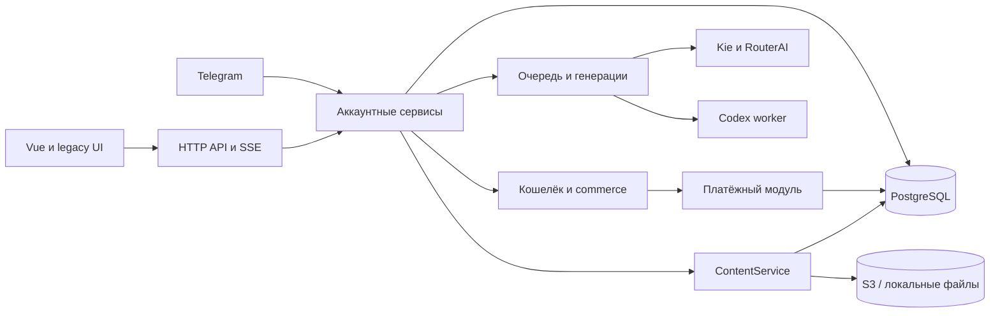

# Аудит AI Media Client: код, архитектура и БД

Дата: 27 сентября 2026. База сравнения Git: `28b72d6`, с учётом текущего рабочего дерева.

## Вывод

**Качество среднее: у проекта хорошая инженерная основа, но его готовность к надёжной публичной эксплуатации пока недостаточна.** Основной долг находится на границах модулей, в проверке конкурентных операций, правах БД и процессе выпуска. Переписывать приложение целиком или переводить всё на классы не требуется.

Положительные стороны: транзакции и блокировки кошелька, целые денежные единицы, идемпотентность, outbox, аккаунтные ключи хранения, серверная проверка OAuth, восстановление неопределённых генераций, TypeScript strict во Vue, внедрение тестовых адаптеров. Однако проходящие тесты пропускают ошибки webhook, Telegram и прокси реплик.

**Приоритет:** закрыть найденные дефекты безопасности и интеграций, укрепить данные и выпуск, затем постепенно разделить крупные модули. [План доработок](project-improvement-plan-2026-09-27.md).

## 1. Объём и пределы проверки

- Проверены устройство текущего репозитория, конфигурация, точки входа, HTTP/auth, очередь, провайдеры, биллинг и платежи, контент/S3, Telegram, Vue/legacy UI, SQL, тесты, Docker и документация.
- Проведены статическая инвентаризация и углублённое чтение критичных путей; это не утверждение о построчной проверке каждого файла и не формальная сертификация безопасности.
- Подключённая PostgreSQL исследована отдельными транзакциями `BEGIN READ ONLY`: каталоги, права, версии схемы и агрегатные инварианты. Секреты и содержимое пользовательских записей в отчёт не включены.
- Проверки дефектов выполнялись на PGlite и локальных HTTP-заглушках внутри одноразовых контейнеров `tests` текущего Compose-проекта. Рабочие платежи и генерации не создавались.
- Активного `desktop/` нет. В `desktop.7z` прочитаны манифест, preload и критичные участки main; архив не разворачивался в новый продукт. Запуск Electron, установщик и весь архивный desktop-код не проверены динамически.
- Живые OAuth-входы, доставка настоящему Telegram-пользователю, sandbox/live-оплата, платные генерации, восстановление backup и длительная нагрузка не выполнялись. Полного браузерного e2e-прогона нет.
- Продуктовый код и SQL не исправлялись: запрос касался аудита и плана. Добавлены отчёты и краткая память о результатах; по обязательному контракту обновления правил отдельно применены три миграции GI, включая поступившую во время аудита.

### Размер активного дерева

Инвентаризация текстовых исходников, без зависимостей, JSON-каталогов, изображений и собранного `public/vue`:

| Область | Файлов | Строк |
| --- | ---: | ---: |
| `src` | 98 | 9 550 |
| `web/src` | 41 | 7 566 |
| `public`, без Vue-бандлов | 23 | 4 421 |
| `test` | 40 | 4 944 |
| `scripts` | 8 | 488 |

Это строки с пробелами и комментариями, а не метрика качества. Дополнительно изучены корневые manifest/entrypoint/Docker/SQL-конфигурации. Статический проход по 137 JS/TS/Vue-файлам нашёл 278 литеральных локальных зависимостей без обнаруженных циклов; динамические загрузки и зависимости, не распознаваемые таким проходом, этим не исключаются.

## 2. Реальная архитектура

Это **модульный монолит с отдельным Codex worker**, компонентным Vue-интерфейсом и сохранённым legacy UI. Backend смешивает функции-фабрики, сервисные объекты и небольшие классы. Это допустимая модель для данного продукта.

Хорошие границы: `billing/wallet`, `payments`/`commerce`, OAuth adapters, storage adapter, provider clients. Более слабые: HTTP одновременно создаёт сервисы и маршрутизирует их, сервисы раскрывают `pool`, `history`, `queue`, а клиентский store объединяет почти всё поведение студии.

Наличие `src/media/index.mjs` с универсальным контрактом ещё не означает, что весь продукт следует ему. В текущих JS/MJS runtime-импортах этот фасад не найден: его используют контрактные тесты; рабочий путь идёт через `services/media-service.js`, `provider-router.js` и отдельные billing-сервисы Codex/RouterAI.

## 3. Подтверждённые проблемы и риски

Приоритеты: **P1** — исправить до включения затронутого публичного/денежного сценария; **P2** — ближайшие доработки надёжности; **P3** — плановый долг. Статус «по коду» не означает воспроизведённый инцидент.

### A01 · P1 · Прокси web-реплики может обращаться вне executor

**Подтверждено изолированным HTTP-воспроизведением.** `src/server/http.js:125` строит адрес через `new URL(req.url, executorUrl)`. Путь с двумя начальными слешами заменяет authority. Ветка пересылки на строке 216 выполняется до проверки пользователя на строке 302.

На реплике с включённым auth отправка пути вида `//127.0.0.1:<порт-заглушки>/audit-probe` привела к обращению к заглушке: `targetHits=1`, `authCalls=0`. Это SSRF: неавторизованный запрос может заставить сервер обращаться к другому сетевому адресу. Пересылаются также входные заголовки.

Затронут режим `MEDIA_REPLICA_ROLE=web`; в текущем основном Compose запущен executor, профиль replicas не включён. Исправление: принимать только допустимый origin-form, жёстко сохранять origin executor, проверять маршруты и заголовки пересылки, ограничить время upstream-запроса. Принципы allowlist и проверки адресов описаны в [OWASP SSRF Prevention](https://cheatsheetseries.owasp.org/cheatsheets/Server_Side_Request_Forgery_Prevention_Cheat_Sheet.html).

### A02 · P1 · Уведомление об успешной оплате не находит существующий платёж

**Подтверждено на изолированной БД.** `src/payments/service.js:118` получает `{client_id, environment}`, а `applyProviderResult` через `select` ожидает `{clientId, environment}`. Webhook возвращает `NOT_FOUND`, HTTP 404; созданный pending-платёж остаётся `pending`.

Исправление: явное преобразование строки БД в контракт контекста; тест полного пути webhook → payment → outbox → order → wallet. Проверка дубликатов и возвратов должна идти через публичный фасад сервиса. Текущий debug stub не подтверждает работу реальной ЮKassa.

### A03 · P1 · Runtime подключается к PostgreSQL с правами superuser

**Подтверждено в действующей БД, только чтение.** У текущей роли `rolsuper`, `rolcreatedb`, `rolcreaterole`, `rolbypassrls` равны `true`. Приложению для обычных запросов эти права не нужны; компрометация runtime имеет существенно больший масштаб последствий.

Исправление: отдельные роли миграций и приложения; runtime получает необходимые DML/sequence-права без superuser, создания ролей/БД и обхода RLS. Не включать RLS формально: сначала определить tenant-контекст, pooling и административные сценарии. Текущие права аудитом не менялись.

### A04 · P1 · Изменение статуса платежа не защищено от конкурентных ответов

**Риск подтверждён устройством кода; многосоединительное воспроизведение не выполнено.** В `src/payments/service.js:21–34` чтение payment выполняется без `FOR UPDATE`, затем проверяется переход и выполняется безусловный `UPDATE ... WHERE id=$1` без проверки прежнего статуса/revision.

Две транзакции могут прочитать `pending`; одна сохранит `succeeded`, вторая позднее запишет свой устаревший `pending`. Проверка `assertTransition` увидела старый снимок. После A02 этот путь особенно важен при одновременных webhook/reconcile. Нужны блокировка payment до проверки перехода либо compare-and-set по revision и повторное чтение при конфликте. Внешний HTTP-вызов должен оставаться вне SQL-транзакции.

### A05 · P2 · Обычный связанный Telegram-пользователь получает отказ

**Подтверждено вызовом реального аккаунтного фасада на изолированной БД.** `telegram-gateway.js:36` и `accounts.js:101` вызывают `scope(identity, identity.id)`, но `accounts.js:113` запрещает любой непустой `selected` для неадминистратора. Получен 403 «Доступ запрещён» даже для собственного ID.

Исправление: явно разделить собственный аккаунт и административный выбор чужого; сохранить запрет чужого доступа. Проверить gateway и создание задачи обычного связанного пользователя, отвязку и повторное подтверждение.

### A06 · P2 · Архивирование проекта не атомарно

**Подтверждено внедрением ошибки второго SQL-запроса.** `workspaces.js:120–125` отдельно архивирует проект и его чаты. При сбое второй записи проект оказался архивным, чат — активным.

Нужна одна транзакция с определённым порядком блокировок и тест отказа между записями. Также проверить конкурентные create/move/restore: проверки архивности и последующая запись сейчас разделены.

### A07 · P2 · БД допускает связь чата с проектом другого аккаунта

**Подтверждено вставкой только в тестовую БД.** `schema.sql:101` ссылается на `media_projects(id)` без `account_id`. Два независимых FK подтверждают существование аккаунта и проекта, но не совпадение владельца. Приложение проверяет это в `workspaces`, однако БД принимает несогласованную связь.

Нужен составной FK `(account_id, project_id)` на соответствующий уникальный ключ проекта после проверки существующих данных. Для логических связей в `media_records.data` нужны проверяемые инварианты: объект JSON, допустимые обязательные поля по namespace, согласованность ID и chat/project. Не обязательно полностью отказываться от JSONB. В PostgreSQL составные FK прямо выражают такую связь: [документация ограничений](https://www.postgresql.org/docs/15/ddl-constraints.html).

### A08 · P2 · Версии схемы не управляют выполнением миграций

**Подтверждено по коду.** `database.js:54–58` на каждом старте выполняет весь `schema.sql`, затем SQL сам добавляет номера версий. Есть транзакция и advisory lock — это правильно, но нет отдельных неизменяемых миграций, checksum, проверки неизвестной более новой схемы и исполнения только pending-версий. `IF NOT EXISTS` не проверяет правильность уже существующей таблицы.

Нужен версионированный runner, отдельная роль миграций, тесты чистой установки и обновления с предыдущей версии. Это также позволит убрать DDL-права из runtime.

### A09 · P2 · Чистый тестовый контейнер не проходит штатный полный набор

**Подтверждено.** Из 186 тестов один падает: `test/accounts.test.js:60` вызывает `mkdtemp` внутри отсутствующего `/app/artifacts`. После создания каталога в одноразовом контейнере — 186/186. Тест зависит от случайно подготовленного окружения.

Отдельная проблема покрытия: `test/helpers/pg-pool.js:5–16` сериализует соединения PGlite. Такие тесты полезны для SQL и транзакционной логики, но не доказывают отсутствие межсоединительных гонок PostgreSQL, работу настоящего LISTEN/NOTIFY или сетевой failover. Нужен небольшой набор тестов на реальной изолированной PostgreSQL наряду с быстрым PGlite.

### A10 · P2 · Docker-выпуск не собирает Vue из исходников

**Подтверждено по Dockerfile.** Production stage копирует готовый `public/`; команды `build:web` и `check:web:vue` в сборку не входят. Поэтому изменение `web/src` может не попасть в образ без отдельной ручной сборки. Сейчас имена JS/CSS-бандлов совпали со свежей контейнерной сборкой — текущая рассинхронизация не обнаружена.

Нужен frontend build stage либо обязательный проверяемый pipeline до image build. `pnpm check` проверяет выбранные JS-файлы, но не Vue-типы. В дереве не найден CI workflow; наличие внешнего CI этим не исключается. Разделение сборки, выпуска и запуска: [Twelve-Factor App](https://12factor.net/build-release-run).

### A11 · P2 · Скачивание результатов не ограничено по объёму

**Подтверждено по коду.** `content-service.js:141–150` считает байты потока, но не прерывает его по лимиту. Аналогично `downloads.js`. Пять минут timeout ограничивают время, а не место на диске. Входящие загрузки ограничены лучше.

Для удалённых URL проверяется HTTPS, но отсутствует единая политика допустимых адресов и редиректов; проверка конечного protocol выполняется уже после fetch. Это дополнительный риск на границе поставщика, без доказанного прямого пути произвольного пользователя к любому URL. Нужны лимит байтов на поток, квота staging, контроль редиректов/адресов и очистка незавершённых файлов.

### A12 · P2 · Крупные модули объединяют разные обязанности

**Архитектурный долг.** `http.js` — 714 строк; `studio.ts` — 793; `Composer.vue` — 686; `media-service.js` — 463. Размер сам по себе не является нарушением. Причина замечания — совместное владение auth/routing/proxy/static/provider lifecycle в HTTP, а в store — bootstrap, история, polling, черновики, выбор моделей, проекты и отправка.

Выделять реальные границы: router/middleware, composition root, use cases; во Vue — небольшие stores/composables для синхронизации истории, черновиков, каталога и отправки. Не вводить универсальный контейнер DI или иерархию классов ради формального соответствия SOLID.

### A13 · P2 · Запросы по chat/project в JSONB требуют отдельной оптимизации

**Подтверждены запросы и отсутствие соответствующих expression indexes; задержка под нагрузкой не измерена.** `workspaces.js:57,66,96,103,139,145,185` фильтрует и считает записи по `data->>'chatId'`/`projectId`. В действующей БД таких индексов нет. Индексы истории по createdAt/state уже присутствуют — их отсутствие не заявляется.

При росте истории повторные подсчёты могут стать дорогими. Сначала измерить `EXPLAIN (ANALYZE, BUFFERS)` на реалистичной изолированной выборке; затем добавить адресные индексы или вынести наиболее важные связи в столбцы. Журнал также использует OFFSET и полные COUNT: следующий кандидат для измерения, не причина немедленно ставить отдельную СУБД.

### A14 · P2 · Платёжный контур ещё не завершён до production-контракта

**Известный незавершённый функционал, подтверждённый кодом и существующим планом.** Таблица `payment_webhook_inbox` создана, но путь webhook её не использует. Не реализован durable command worker для ответа, потерянного после внешнего принятия. `reconcile` требует уже известный provider ID. Адаптер ЮKassa объявляет `refunds: true`, `partialRefunds: true`, но refund-операций в модуле нет.

Не считать эти возможности работающими по наличию таблиц/флагов. Уточнить фактические capabilities, завершить восстановление неизвестных результатов, inbox и выбранный объём возвратов до реальных продаж. Подробности уже описаны в [плане платежей](payments-implementation-plan.md).

### A15 · P3 · Контракт ошибок и API слабо формализован

`http.js:679–695` распознаёт ожидаемые ошибки по началу русской строки и по умолчанию отдаёт 400 даже для неожиданного серверного сбоя. Frontend `api/client.ts:17–29` приводит распарсенный JSON к `T` без runtime-валидации; TypeScript не проверяет полученный JSON. Широкий RPC принимает строковое имя метода.

Нужны стабильные error codes, явные 4xx/5xx, ограниченные схемы команд/ответов в важных местах. Начать с auth, billing, webhook и submit; не валидировать одинаково каждое внутреннее вычисление.

### A16 · P3 · Документация и команды расходятся с текущим деревом

README/runbook обещают доступный `desktop/`, упоминают schema v4 и отключённую до привязки Telegram-интеграцию. Фактически desktop только в архиве, БД имеет v9, код привязки существует. Часть страниц говорит, что покупка кредитов не подключена, хотя уже есть debug checkout и частичная реализация платежей. `known-issues.md` до этого аудита описывал состояние 17 сентября.

Нужно явно разделить текущий web-продукт, исторический desktop, реализованный debug и ещё не подтверждённый production. Для desktop не обещать работоспособность недоступных команд. Архив не удалять без отдельного решения.

### A17 · P2 · Восстановление и эксплуатационная готовность не подтверждены

В проекте есть планы backup/restore, но проверенного в этом аудите восстановления PostgreSQL + S3 + локального состояния нет. Нет подтверждения целевых RPO/RTO и оповещения об удержанных резервах, остановившихся content jobs или задержке payment outbox. JSONL имеет ограниченную ротацию и редактирует секреты, но может содержать пользовательские prompts: нужен понятный режим доступа и хранения.

Это пробел доказательств эксплуатационной готовности, а не утверждение об отсутствии резервных копий у внешнего провайдера. Восстановление проверять на отдельном безопасном окружении; платные нагрузочные проверки — по отдельному согласованному сценарию.

## 4. Аудит структуры БД

Действующая PostgreSQL: **15.16**. Таблиц `public`: **30**; зарегистрированы версии **1–9**. Каталог показал 30 PK, 32 FK, 13 UNIQUE constraints, 44 CHECK constraints; сюда не включены самостоятельные unique indexes. Совокупный размер пользовательских таблиц с индексами на момент снимка — около 4,4 MiB, поэтому текущий небольшой объём не доказывает поведение на масштабе.

### Инвентарь

| Таблица | Назначение и ключевой контракт |
| --- | --- |
| `media_schema_versions` | Номер схемы, PK version; сейчас журнал, не полноценный migration runner |
| `media_accounts` | UUID аккаунта, display name, ограниченная роль |
| `media_identities` | PK(provider, subject), связь с account; verified email отдельно |
| `media_sessions` | Хеш токена, account, expiry; сырой session token не хранится |
| `media_oauth_flows` | Хеши state/browser, PKCE verifier, expiry |
| `media_admin_invitations` | Приглашения по подтверждённому email, отметка использования |
| `media_role_audit` | Кто/почему изменил роль, прежнее и новое значение |
| `media_telegram_links` | Уникальные Telegram user и account |
| `media_telegram_link_flows` | Хеш одноразового токена, срок действия и использование |
| `media_projects` | UUID, account, owner, название, архивность |
| `media_chats` | UUID, account, project, mode, context JSONB; замечание A07 |
| `media_records` | PK(account, namespace, id), изменяемый JSONB и updated_at |
| `media_deleted_chat_records` | Tombstones удалённых записей для корректной синхронизации |
| `media_wallets` | Account PK, целые balance/held; CHECK 0 ≤ held ≤ balance |
| `media_reservations` | Job PK, сумма, версия цены, held/captured/released |
| `media_ledger` | Операции, actor, детали; UNIQUE(account, kind, reference) |
| `media_reconciliations` | Ручная сверка задачи с actor и доказательством |
| `media_orders` | Snapshot предложения, checkout key/hash, сумма и credits, payment ID |
| `media_payment_inbox` | Дедупликация событий платежного модуля в продукте |
| `media_order_fulfillments` | Однократная выдача по order/payment/ledger reference |
| `content_assets` | PK(account, UUID), уникальный storage key, MIME, размер, SHA-256, статус |
| `content_links` | Составные account-scoped FK к record и asset, роль/позиция |
| `content_jobs` | Фоновое сохранение, состояние, attempts, retry time и владелец |
| `media_file_deletions` | Отложенное удаление файлов после коммита удаления чата |
| `payment_payments` | Клиент/среда/order, сумма minor units, статус, revision |
| `payment_commands` | Идемпотентная команда с payload hash |
| `payment_attempts` | Provider/account/environment и provider payment ID |
| `payment_webhook_inbox` | Задуманный сырой inbox; runtime-путь пока не подключён |
| `payment_outbox` | Событие, revision, lease, попытки, доставка |
| `media_kie_submissions` | Журнал попыток платной отправки и неопределённого результата |

### Оценка модели

1. **Денежное ядро спроектировано разумно.** BIGINT, проверка допустимого диапазона кошелька, отдельные hold/reservation/ledger, уникальность повторных операций, блокировки и общий transaction boundary при завершении задач.
2. **Контент имеет хорошие tenant-границы.** Составные FK в `content_links` удерживают account и связь объекта вместе. UUID, SHA-256 и отдельные задания дают проверяемое сохранение.
3. **Граница payments/commerce осмысленная.** Отсутствие FK из payment_* к media_* явно предусмотрено изоляцией модулей. Это не ошибка нормализации; целостность на этой границе должны обеспечивать контракты, inbox/outbox и reconciliation.
4. **JSONB здесь допустим**, особенно для разнородных provider payloads. Но доменные связи, состояния и timestamps, по которым приложение регулярно фильтрует данные, требуют более строгих гарантий. Поле `resultJson` иногда дополнительно содержит JSON-строку внутри JSONB — это усложняет запросы и проверку формы.
5. **RLS не включён ни на одной из 30 таблиц.** Изоляция основана на коде и составных ключах. Само отсутствие RLS не доказывает утечку. Возможное внедрение — дополнительная защита после снятия superuser и проектирования контекста подключений.
6. **Политика удаления должна быть явной.** Нельзя автоматически каскадно удалять финансовую историю вместе с аккаунтом. FK без каскада здесь могут быть намеренным ограничением; нужны отдельные правила хранения/анонимизации и восстановления.
7. **Default system chat защищается кодом**, а не уникальным partial index. Текущих дублей не найдено; при усилении модели проверить archive/restore и конкуренцию, затем вводить ограничение.

### Проверки действующих данных

Все ниже — агрегатные read-only запросы; это снимок, а не доказательство отсутствия любой ошибки данных.

| Проверка | Нарушений |
| --- | ---: |
| Сумма held reservations отличается от wallet.held | 0 |
| Чат связан с проектом другого аккаунта | 0 |
| История/codex/routerai/drafts с chatId без чата своего аккаунта | 0 |
| `media_records.data` имеет тип JSON, отличный от object | 0 |
| Несколько активных system chats для одной пары account/project | 0 |
| `media_projects.owner_id` отличается от account_id | 0 |

Тестовая БД при этом приняла запрещаемую бизнес-логикой межаккаунтную связь A07. Отсутствие плохих данных сейчас не заменяет ограничения схемы.

## 5. SOLID и принципы со скриншотов

SOLID — рекомендации проектирования, а не сертификат и не требование иметь классы. Vue Composition API использует функции, реактивное состояние и композицию; его не следует автоматически называть чистым функциональным программированием. [Документация Vue](https://vuejs.org/guide/extras/composition-api-faq.html).

| Принцип | Оценка для этого проекта |
| --- | --- |
| SRP | Частично: wallet/contracts/adapters достаточно сфокусированы; HTTP, studio и Composer имеют несколько независимых причин изменения |
| OCP | Частично: OAuth registry и adapters расширяемы; добавление AI-провайдера требует веток в HTTP, UI и billing |
| LSP | Не оценивать по наследованию: глубоких иерархий здесь нет. Нужны общие поведенческие тесты заменяемых storage/provider/store adapters, включая ошибки и async-семантику |
| ISP | Частично: отдельные доменные API существуют, но RPC/MediaService и публичные внутренности accounts образуют слишком широкую поверхность |
| DIP | Частично: pool/provider/fetch/storage внедряются; HTTP сам создаёт конкретные сервисы, прикладные модули напрямую зависят от SQL и структуры чужих объектов |
| DRY | Есть полезное переиспользование wallet, pricing, retry, UI-domain. Состояния генераций, проекции записей, legacy/Vue и отдельные provider flows частично дублируются |
| KISS | Плюс: простой монолит без обязательных брокеров. Минус: ручной router, смешанные обязанности и сжатые многооператорные строки повышают сложность |
| YAGNI | Не нужны обязательные микросервисы, event sourcing, универсальный framework или массовая миграция на классы. Проверить смысл параллельного неиспользуемого media-фасада и преждевременных capabilities |
| SoC | Верхнеуровневые папки разделены; внутри крупных файлов UI/оркестрация/инфраструктура ещё смешиваются |
| Закон Деметры | Частично: вызовы через accounts.pool, service.queue и service.history раскрывают устройство соседних модулей. Оценивать знание чужого состояния, а не просто число точек в выражении |
| Композиция вместо наследования | В основном соблюдается: фабрики, callbacks, Vue-компоненты, adapters; наращивать наследование не нужно |
| Инкапсуляция | Закрытые переменные фабрик полезны; широкое раскрытие сервисов и изменяемого состояния ослабляет границы |
| Абстракция | Реальные интерфейсы есть; названия media-фасадов и несовпадение runtime/тестового пути требуют ясности |
| Полиморфизм | Есть через duck typing, factories и подменяемые providers; формальное ключевое слово interface не обязательно |
| Наследование | Не является целевой метрикой. Отсутствие иерархии не снижает качество компонентного приложения |

Не следует устранять одинаковые строки автоматически: client-side UX-валидация и серверная авторитетная проверка имеют разные задачи; денежные операции могут иметь разные SQL-формы ради атомарности. DRY относится прежде всего к единому знанию о правилах, а не к минимальному числу повторяющихся символов.

## 6. Выполненные проверки

| Проверка | Результат |
| --- | --- |
| `docker compose up -d --build` | Выполнено для текущего проекта |
| Compose и `/api/health` | media/codex healthy, kie-browser running; HTTP 200, `ok=true`, БД connected |
| Полный контейнерный набор, concurrency=2 | 185/186; ошибка неподготовленного artifacts, A09 |
| Тот же набор с `mkdir -p artifacts` внутри одноразового контейнера | 186/186, около 42 секунд, без пропусков |
| `check:web:vue` и `build:web` в тестовом контейнере | Успешно; 77 преобразованных модулей; runtime-ссылки theme.js/theme.css остались внешними, как предусмотрено сервером |
| Проверка синтаксиса в контейнере | 149 JS/CJS/MJS исходных файлов, ошибок нет; браузерные ESM-бандлы исключены из CommonJS-проверки |
| `pnpm check` на хосте | Успешно, контракт 176 моделей; вспомогательная проверка |
| `pnpm audit --prod` / `pnpm audit` | Реестр не сообщил известных уязвимостей: 0; это не аудит OS-образов, внешнего worker или всего supply chain |
| HTTP/SQL-воспроизведения A01/A02/A05/A06/A07 | Ошибки подтверждены на изолированных ресурсах |
| Действующая БД | Read-only результаты в разделе 4; superuser подтверждён |
| GI | Применены 2026.09.27.1, 2026.09.27.2 и 2026.09.27.3; routing/bootstrap проверки пройдены; ожидающих миграций 0 в принятом снимке источника |

Логи проверок сохранены в игнорируемом `artifacts/audit-2026-09-27/`. Внешний `llm-providers:local`, его полная реализация, настройки облачного PostgreSQL/S3 и production reverse proxy не проверялись как отдельные проекты. Их отсутствие в этом аудите не подменено обещанием безопасности.

## 7. Что считать завершением доработок

См. [план с порядком и критериями приёмки](project-improvement-plan-2026-09-27.md). Найденные дефекты остаются открытыми. Итог аудита — проверенные замечания и план, а не исправленный production-релиз.
