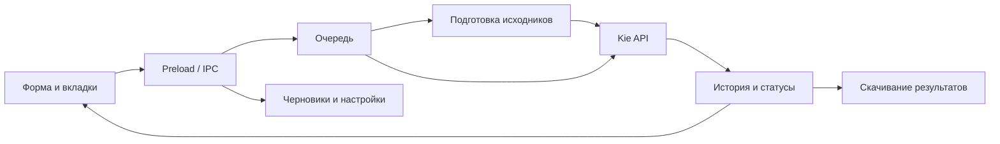

# Архитектура

## Веб-сервис и Telegram (2026-09-17)

В корне репозитория находятся Node HTTP-сервис server.js, браузерное представление public/ с собственными
модулями src/, прикладной media-service и Telegram-контроллер/gateway. Каталог,
очередь, валидация, хранение исходников и расчёты переиспользованы. Веб и бот
работают в общей серверной области данных, отдельно от desktop. Ключ Kie —
только server env. Контракт: [web/Telegram](specs/features/web-telegram.md).
Ниже — исходная архитектура desktop, применимая к Electron runtime.

Дата исследования: 2026-09-17. Источники: desktop/package.json, desktop/src/main.js, desktop/src/preload.js, desktop/src/index.html.

Продукт — локальный Windows-клиент внешней генерации изображений и видео. Пользователь выбирает модель, задаёт параметры и исходники, добавляет запрос в очередь, наблюдает статус и сохраняет результат.

## Границы

- Главный процесс: API, ключи, файлы, очередь, история, тарифы, уведомления и отдельная сессия Kie.
- Preload: явные методы window.desktop и события IPC. Renderer не получает прямой доступ к Node.
- Renderer: динамические формы, до пяти рабочих вкладок, история, стоимость, предпросмотр и черновики. Обычные HTML/CSS/JS, без UI-фреймворка.
- Доменные модули: TaskQueue, History, Assets, PromptTemplates, адаптеры запросов, расчёты стоимости.
- Нет собственного серверного API, SQL-хранилища продукта или локальной ML-инференции.

При старте создаются локальные хранилища, очередь восстанавливает записи и начинает опрос известных удалённых заданий. Новые отправки остаются на паузе. Завершение генерации вызывает уведомление и опциональное скачивание. Закрытие окна сначала сохраняет черновики; при ошибке окно остаётся открытым. После закрытия главного окна уничтожаются дополнительные окна, включая скрытое окно проверки цен.

Для основного окна заданы contextIsolation=true, nodeIntegration=false, sandbox=true. Не считать это аудитом всех IPC-методов: общий контроль отправителя применяется не ко всем обработчикам (см. known-issues.md).

Текущая структура: веб/Telegram — корневые src/, public/, server.js, package.json, Dockerfile. Windows — desktop/src/, desktop/test/, desktop/scripts/ и desktop/package.json. Единственный дистрибутив — desktop/dist/queue-header. Данные сервиса — data/service, локальные .env не входят в Git.
