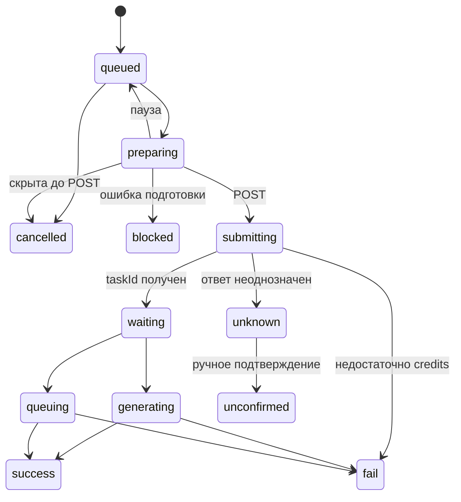

# Генерация и очередь

Цель: выполнять сохранённые запросы без случайной повторной платной отправки. Актор — локальный пользователь с ключом выбранного провайдера. Основание: src/task-queue.js, src/main.js, src/renderer.js; проверки: test/queue.test.js.

## Вход и алгоритм

1. По providerId и API-имени модели найти каталоговую запись, проверить длительность, схему и межполевые ограничения.
2. Запомнить вход, используемые исходники, рабочую вкладку, курс рубля и доступную оценку цены; создать локальный UUID, state=queued, taskId=null.
3. При запуске взять старейшую видимую queued-запись. Лимит 1–5, по умолчанию 3; preparing, submitting и удалённые активные состояния занимают слот.
4. В preparing проверить ключ, разрешить локальные исходники в свежие URL загрузки и повторно проверить вход.
5. Проверить паузу/закрытие/скрытие записи перед POST. Сохранить submitting и время начала ДО отправки.
6. Полученный taskId сохранить вместе с waiting. На последующих тиках опрашивать все известные активные задачи; обычный интервал 4 секунды.
7. success/fail завершает генерацию и освобождает слот. Скачивание после success не занимает слот и не превращает успех генерации в ошибку.

Диаграмма показывает основные переходы; опрос может сразу вернуть success/fail из waiting, а удалённые активные состояния могут сменять друг друга.

## Инварианты и сбои

- Одновременно выполняется не более одного tick; отправки FIFO, опрос задач параллельный.
- Пауза останавливает новые отправки, но сохраняет опрос уже принятых провайдером задач.
- Уменьшение лимита не отменяет активные задачи.
- Ошибка опроса сохраняет taskId и ставит новые отправки на паузу.
- Неопределённый исход POST => unknown, очередь на паузе. Автоповтор запрещён. Пользователь проверяет журнал провайдера и переводит запись в unconfirmed; это не доказательство отмены у провайдера.
- Недостаток средств => fail с INSUFFICIENT_CREDITS; следующие запросы сохраняются до ручного продолжения.
- Ошибка подготовки => blocked. Не обещать автоматического повтора blocked.
- Удаление из очереди ставит queueHidden; ожидающее задание отменяется локально. Удалённое задание не отменяется, история сохраняется. Очистка сначала ставит паузу.
- generationDurationMs измеряет время от отправки до обнаружения терминального статуса, а не только вычисления у провайдера; providerDurationMs хранится отдельно.

## Восстановление и критерии проверки

preparing восстанавливается в queued (или cancelled для скрытого); submitting без taskId становится unknown. Известные удалённые задачи опрашиваются автоматически, новые queued не запускаются сами. Старые ошибочно неопределённые отказы из-за credits переводятся в fail.

test/queue.test.js проверяет восстановление, неопределённый POST, FIFO, параллельные слоты, паузу, очистку, удаление при подготовке, отсутствие двойной отправки и освобождение слота до окончания скачивания. Живое выполнение API в этом исследовании не проверялось.
