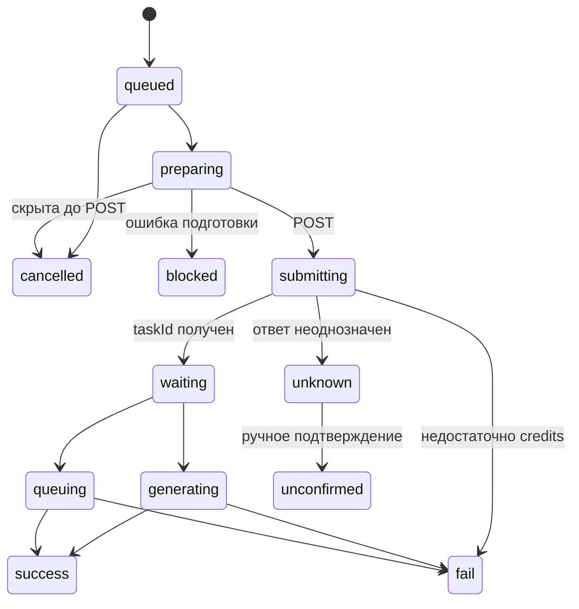

# Генерация и очередь

Цель: выполнять сохранённые запросы без случайной повторной платной отправки. Актор — локальный пользователь с ключом выбранного провайдера. Основание: src/task-queue.js, src/main.js, src/renderer.js; проверки: test/queue.test.js.

## Вход и алгоритм

1. По providerId и API-имени модели найти каталоговую запись, проверить длительность, схему и межполевые ограничения.
   Для моделей Kie со строковым полем `duration` каталог отдаёт строковые варианты. Сохранённое целое числовое значение длительности сервер переводит в строку до проверки схемы и перед отправкой провайдеру; недопустимая длительность по-прежнему отклоняется.
2. Запомнить вход, используемые исходники, рабочую вкладку, курс рубля и доступную оценку цены; создать локальный UUID, state=queued, taskId=null.
   Одновременные повторы одного `requestId` сериализуются для идемпотентности, но разные `requestId` проходят подготовку записи независимо и не стоят в общей JS-цепочке.
3. При запуске атомарно забрать старейшие queued-записи во все свободные слоты. Лимит 1–5, по умолчанию 5; preparing и submitting занимают слот. Подготовка и отправка разных слотов выполняются параллельно.
4. В preparing проверить ключ, разрешить локальные исходники в URL загрузки и повторно проверить вход. Одинаковый локальный исходник в параллельных задачах использует один общий in-flight upload. После завершения single-flight запись удаляется: срок жизни provider URL не предполагается и следующая отдельная серия получает свежий URL.
5. Проверить существование записи перед POST. Пауза запрещает захват новых записей, но уже получивший слот item не откатывается в `queued`. Сохранить submitting и время начала ДО отправки.
   Для серверных Kie-аккаунтов все пользовательские очереди одного инстанса используют общий FIFO-ограничитель на ключ: не более 20 новых POST за скользящие 10 секунд. Ожидание разрешения идёт в preparing; перед переходом в submitting повторно проверяется существование записи. Если Kie явно отклонил POST кодом 429, ограничитель выдерживает 10-секундную паузу, а задача возвращается в queued с сохранённым резервом и временем следующей попытки `retryAfterAt`. До этого времени её не выбирает диспетчер; после перезапуска запись и срок ожидания восстанавливаются из истории. Подтверждённый 429 можно повторять, неоднозначный ответ POST не повторяется.
6. Полученный taskId сохранить вместе с waiting. Независимый poll-цикл опрашивает все известные активные задачи; обычный интервал 2 секунды, что соответствует рекомендованному Kie стартовому диапазону 2–3 секунды. Poll не использует dispatch-lock и продолжает работать во время долгих upload/prepare/create.
7. success/fail завершает генерацию и освобождает слот. Скачивание после success не занимает слот и не превращает успех генерации в ошибку.

Диаграмма показывает основные переходы; опрос может сразу вернуть success/fail из waiting.

## Инварианты и сбои

- Для каждого аккаунта переходы Kie, Codex и RouterAI записываются в отдельный
  append-only namespace `generation-journal` таблицы `media_records`. Запись
  события участвует в транзакции сохранения задачи, когда переход происходит
  внутри транзакции. Записи изолированы по `account_id` и сохраняются после
  удаления карточки. `created` считает генерации, `submitting` Kie и
  `send_start` Codex/RouterAI считают попытки отправки. Попытка не доказывает
  принятие задачи или списание провайдером. Пользовательская выдача исключает
  внешние task ID, себестоимость и сырые диагностические ошибки.

- Одновременно выполняется не более одного диспетчерского tick; занятые им слоты готовятся и отправляются параллельно с сохранением FIFO-порядка захвата.
- Опрос уже принятых задач и запуск новых свободных слотов идут независимыми асинхронными потоками: медленный poll не является барьером перед provider POST.
- Резерв локального кошелька создаётся до отправки, чтобы не принять несколько запросов сверх баланса. Подтверждённый положительный `creditsConsumed` при опросе Kie списывает локальную цену сразу; явно нулевой расход при успехе освобождает резерв. Если модель не сообщает расход по задаче, списание происходит после успешного результата. Удаление из очереди никогда не служит основанием для списания.
- Пауза останавливает новые отправки, но сохраняет опрос уже принятых провайдером задач.
- Уменьшение лимита не отменяет активные задачи.
- Ошибка опроса сохраняет taskId и ошибку конкретного item; остальные items продолжают отправляться и опрашиваться. Ошибочный item автоматически проверяется снова.
- Неопределённый исход POST => unknown только для этого item. Автоповтор этого item запрещён, но независимые queued-запросы продолжаются. Пользователь проверяет журнал провайдера и переводит запись в unconfirmed; это не доказательство отмены у провайдера.
- Серверные отправки Kie учитываются в `media_kie_submissions` при переходе в `submitting`; исход `accepted`/`rejected`/`unknown` фиксируется при выходе из этого состояния в той же транзакции, что и история задачи. Удаление истории не удаляет журнал попыток. Случаи `unknown` также пишутся в `generation.jsonl` событием `kie.submit.unknown`. Админская вкладка «Ошибки отправки Kie» показывает число уникальных генераций, дошедших до POST, число генераций с хотя бы одной неопределённой попыткой, процент и ежедневный график за 7/30/90 дней. Повтор после подтверждённого 429 создаёт новую попытку, но не новую генерацию в знаменателе. Исторические случаи до появления журнала не восстановлены; `unknown` не доказывает ни принятие задачи, ни списание у Kie.
- Недостаток средств => fail с INSUFFICIENT_CREDITS только для соответствующего item.
- Синхронный отказ до создания серверной записи (валидация, связь или другой ответ `createTask`) превращает optimistic item web-студии в локальную `fail`-карточку текущего чата с исходным текстом ошибки. Он исчезает из активной очереди, но остаётся выбранным и видимым до перезагрузки, поэтому пользователь не принимает отказ за потерю задания. Серверная история не подделывается: если повторная сверка находит принятую запись с тем же `requestId`, она заменяет optimistic item.
- Для Codex и RouterAI подтверждение POST не удаляет optimistic item до появления записи с тем же `requestId` в синхронизации истории. Замена карточки и выбранного ID происходит вместе, поэтому временная задержка `/api/workspace/sync` не создаёт пустой кадр в очереди и чате.
- Ошибка подготовки => blocked. Не обещать автоматического повтора blocked.
- После захвата слота переходы состояния item монотонны и записываются compare-and-set из ожидаемого предыдущего состояния. Поздний ответ не может вернуть терминальный или уже отправленный item в более ранний этап.
- Удаление отдельного item физически удаляет только `queued`, `preparing` или `blocked` без provider task ID и признака принятия провайдером. Конкурентный prepare/create использует compare-and-set и не может воссоздать удалённую запись. `submitting`, `waiting`, `queuing`, `generating` и `unknown` сохраняются для сверки и получения результата: отправленную генерацию Kie отменить нельзя.
- «Убрать неотправленные» ставит очередь на паузу и удаляет только безопасные локальные записи. Уже отправленные и неопределённые задачи продолжают опрашиваться либо ждут ручной сверки; успешная история сохраняется.
- generationDurationMs измеряет время от отправки до обнаружения терминального статуса, а не только вычисления у провайдера; providerDurationMs хранится отдельно.
- Для пользовательской диагностики простоя сохраняются отметки этапов: постановка в локальную очередь, подготовка, начало отправки, принятие задачи Kie, первая/последняя проверка, получение и локальное сохранение результата. Эти отметки и `progress`/`providerDurationMs` разрешено возвращать account-scoped клиенту; provider task ID и сырые ответы остаются внутренними.

## Восстановление и критерии проверки

preparing после аварийного рестарта восстанавливается в queued (или cancelled для старой скрытой записи); submitting без taskId становится unknown. Физически удалённые задачи не восстанавливаются и не опрашиваются. Безопасные queued-задачи автоматически возобновляются независимо от других unknown-items; неоднозначный платный POST не повторяется. Старые ошибочно неопределённые отказы из-за credits переводятся в fail.

`test/task-queue-progress.test.js`, `test/record-removal.test.js` и `desktop/test/queue.test.js` проверяют восстановление, неопределённый POST, FIFO, параллельные слоты, паузу, физическую очистку, удаление при подготовке, кредитную финализацию, отсутствие двойной отправки и освобождение слота до окончания скачивания. Живое выполнение API в этих тестах не проверяется.
