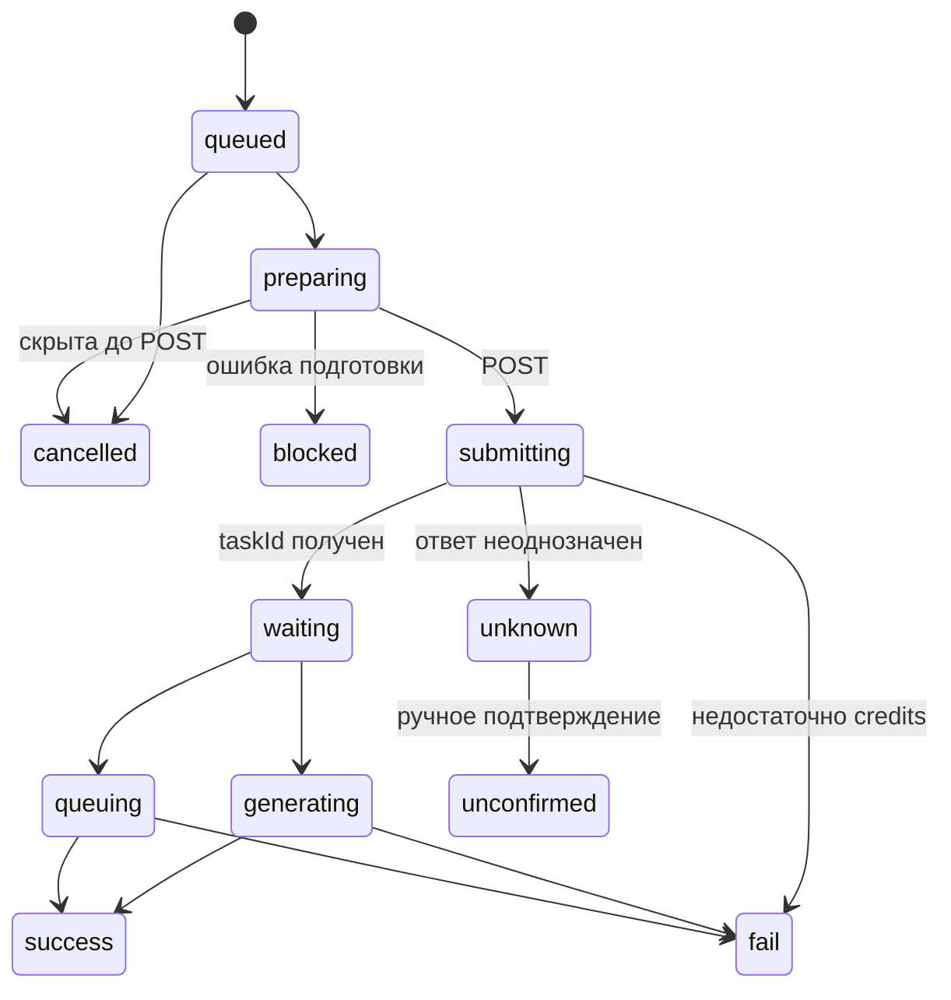

# Генерация и очередь

Цель: выполнять сохранённые запросы без случайной повторной платной отправки. Актор — локальный пользователь с ключом выбранного провайдера. Основание: src/task-queue.js, src/main.js, src/renderer.js; проверки: test/queue.test.js.

## Вход и алгоритм

1. По providerId и API-имени модели найти каталоговую запись, проверить длительность, схему и межполевые ограничения.
2. Запомнить вход, используемые исходники, рабочую вкладку, курс рубля и доступную оценку цены; создать локальный UUID, state=queued, taskId=null.
   Одновременные повторы одного `requestId` сериализуются для идемпотентности, но разные `requestId` проходят подготовку записи независимо и не стоят в общей JS-цепочке.
3. При запуске атомарно забрать старейшие видимые queued-записи во все свободные слоты. Лимит 1–5, по умолчанию 5; preparing, submitting и удалённые активные состояния занимают слот. Подготовка и отправка разных слотов выполняются параллельно.
4. В preparing проверить ключ, разрешить локальные исходники в URL загрузки и повторно проверить вход. Одинаковый локальный исходник в параллельных задачах использует один общий in-flight upload. После завершения single-flight запись удаляется: срок жизни provider URL не предполагается и следующая отдельная серия получает свежий URL.
5. Проверить закрытие/скрытие записи перед POST. Пауза запрещает захват новых записей, но уже получивший слот item не откатывается в `queued`. Сохранить submitting и время начала ДО отправки.
6. Полученный taskId сохранить вместе с waiting. Независимый poll-цикл опрашивает все известные активные задачи; обычный интервал 2 секунды, что соответствует рекомендованному Kie стартовому диапазону 2–3 секунды. Poll не использует dispatch-lock и продолжает работать во время долгих upload/prepare/create.
7. success/fail завершает генерацию и освобождает слот. Скачивание после success не занимает слот и не превращает успех генерации в ошибку.

Диаграмма показывает основные переходы; опрос может сразу вернуть success/fail из waiting, а удалённые активные состояния могут сменять друг друга.

## Инварианты и сбои

- Одновременно выполняется не более одного диспетчерского tick; занятые им слоты готовятся и отправляются параллельно с сохранением FIFO-порядка захвата.
- Опрос уже принятых задач и запуск новых свободных слотов идут независимыми асинхронными потоками: медленный poll не является барьером перед provider POST.
- Пауза останавливает новые отправки, но сохраняет опрос уже принятых провайдером задач.
- Уменьшение лимита не отменяет активные задачи.
- Ошибка опроса сохраняет taskId и ошибку конкретного item; остальные items продолжают отправляться и опрашиваться. Ошибочный item автоматически проверяется снова.
- Неопределённый исход POST => unknown только для этого item. Автоповтор этого item запрещён, но независимые queued-запросы продолжаются. Пользователь проверяет журнал провайдера и переводит запись в unconfirmed; это не доказательство отмены у провайдера.
- Недостаток средств => fail с INSUFFICIENT_CREDITS только для соответствующего item.
- Ошибка подготовки => blocked. Не обещать автоматического повтора blocked.
- После захвата слота переходы состояния item монотонны и записываются compare-and-set из ожидаемого предыдущего состояния. Поздний ответ не может вернуть терминальный или уже отправленный item в более ранний этап.
- Удаление из очереди ставит queueHidden; ожидающее задание отменяется локально. Удалённое задание не отменяется, история сохраняется. Очистка сначала ставит паузу.
- generationDurationMs измеряет время от отправки до обнаружения терминального статуса, а не только вычисления у провайдера; providerDurationMs хранится отдельно.
- Для пользовательской диагностики простоя сохраняются отметки этапов: постановка в локальную очередь, подготовка, начало отправки, принятие задачи Kie, первая/последняя проверка, получение и локальное сохранение результата. Эти отметки и `progress`/`providerDurationMs` разрешено возвращать account-scoped клиенту; provider task ID и сырые ответы остаются внутренними.

## Восстановление и критерии проверки

preparing после аварийного рестарта восстанавливается в queued (или cancelled для скрытого); submitting без taskId становится unknown. Известные удалённые задачи опрашиваются автоматически. Безопасные queued-задачи автоматически возобновляются независимо от других unknown-items; неоднозначный платный POST не повторяется. Старые ошибочно неопределённые отказы из-за credits переводятся в fail.

test/queue.test.js проверяет восстановление, неопределённый POST, FIFO, параллельные слоты, паузу, очистку, удаление при подготовке, отсутствие двойной отправки и освобождение слота до окончания скачивания. Живое выполнение API в этом исследовании не проверялось.
