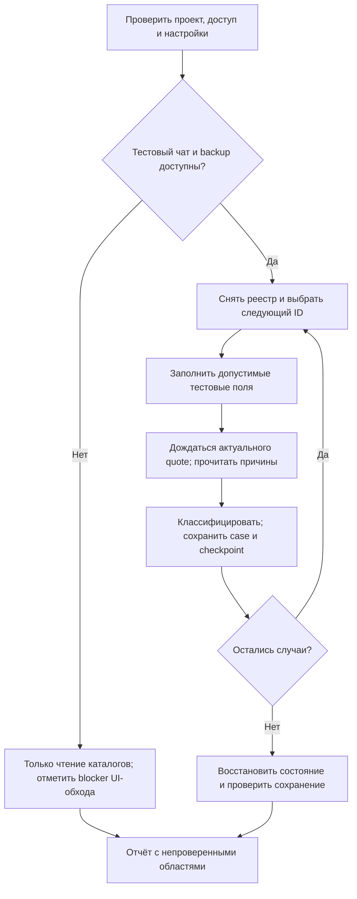

# UI-аудит моделей без генераций

Проверено 2026-10-02; опыт документирован 2026-10-03. Область: каталоги, формы, предварительная цена и маршруты.
Исполнение генераций этим аудитом не подтверждается.

## Назначение, участники и статус

Назначение — ручное функциональное тестирование предварительных цен генераций
и доступности моделей через интерфейс, выполняемое агентом или тестировщиком.
Наблюдаемый результат — воспроизводимый реестр проверок по ID с объяснением
отсутствия цены/маршрута, измеренным покрытием и явно указанными пропусками.

Владелец предоставляет доступ; агент действует в пределах роли текущей сессии.
Администратор проверяет расширенный каталог, настоящий пользователь — каталог
и права своей роли. Агент не меняет роли, тарифы, настройки маршрутов и целевую БД.
Предусловия изменения формы: разрешённое приложение, отдельный тестовый чат,
долговременный приватный backup и возможность исключить запуск генерации.

Текущая реализация — документированный ручной сценарий и выполненный обход
с ограничениями baseline ниже. Продуктовой кнопки аудита, отдельного исполняемого
скрипта, загрузчика JSON-настроек и планировщика повторных запусков нет.
Автоматизация с сетевым запретом запуска задач описана как дальнейшее расширение,
а не как существующее поведение. JSON в документации задаёт работу агента.

## Входы, данные и результат

- Входы: разрешённый адрес приложения, настройки запуска, доступные роли/аккаунты,
  текущие каталоги, реестр маршрутов, тестовый промпт и допустимые параметры формы.
- Единица проверки: версия каталога + роль/представление + провайдер/вид аккаунта
  + режим + вкладка каталога + service/native ID + параметры. Alias сохраняется
  отдельным ID; повторные случаи не увеличивают число уникальных моделей.
- Источники истины: реестр проекта для настроенных маршрутов; подключённый
  каталог для доступных приложению моделей; живой каталог провайдера для его
  опубликованных ID; завершённый quote для предварительной стоимости запроса;
  наблюдаемый UI для видимости, валидации и состояния кнопки.
- Результаты: применённые настройки, снимок реестра, случаи проверки,
  checkpoint и сводка с различиями относительно предыдущего запуска.
  Схема полей и пути артефактов определены в инструкции повторного обхода.
- Данные запуска сохраняются под новым ID в ignored `outputs/`; приватный backup
  находится отдельно в ignored `data/service/ui-audit-private/` и не является
  частью публичного отчёта. Результаты аудита не импортируются в runtime-каталоги/БД.
- Свежесть: каждый результат относится к зафиксированным времени и каталогу.
  Изменение каталога при продолжении создаёт новый снимок; старое покрытие
  не переносится автоматически на новые ID или параметры.

## Последовательность и конечные состояния

Запуск завершается одним из состояний:

- `complete`: покрытие выбранной области полностью учтено, результаты сохранены,
  генераций не запускали, восстановление подтверждено и обязательная проверка
  среды выполнена. Найденные дефекты не препятствуют завершению самого аудита.
- `incomplete`: есть непроверенные случаи/роли или прерывание; checkpoint
  сохранён и содержит остаток работы. Пропуск не считается пройденной проверкой.
- `blocked`: обязательный доступ, backup, каталог или проверка среды недоступны;
  выполненные независимые чтения сохраняются, причина блокировки указана.
- `restoration-required`: исходное состояние не восстановлено/не подтверждено;
  приватный backup сохраняется, запуск не объявляется завершённым.

Отсутствие нужных файлов/task fixtures ограничивает проверку конкретного case,
но не останавливает независимые случаи. При ошибке quote выполняется ограниченный
повтор по настройкам, затем сохраняется timeout/ошибка; цена не выдумывается.
При остановке владельцем или сбросе сессии сохраняется доступный checkpoint;
перед продолжением повторно проверяются доступ, тестовый чат и свежесть каталога.
При попытке генерации обход прекращается до выяснения состояния задачи.

## Условия приёмки и карта реализации

- Сводка связывает каждый пункт текущего реестра с проверкой, отсутствием
  в конкретном меню или явно обоснованным пропуском. Отдельно посчитаны прямые
  каталоги и «Автомат»; число случаев не выдано за число уникальных моделей.
- Классификация цены основана на конечном quote выбранного ID и тестовых
  параметрах. Исходные причины сохранены; расходный тариф и недостающие входы
  не названы исчезнувшей моделью.
- Подтверждены отсутствие действий запуска и восстановление состояния;
  наблюдение сети/истории и его ограничения отражены раздельно.
- Пройдены обязательные проверки из `AGENTS.md`/runbook либо записан конкретный
  blocker. Изменения документации не означают нового выполненного UI-обхода.

Карта текущих источников: `config/model-routes.json`, `src/catalog.js`,
`src/billing/kie-pricing.js`, `src/providers/apimart/pricing.js`,
`src/providers/routerai/pricing.js`, `src/services/auto-model-routes.js`;
формы и расчёт — `web/src/components/Composer.vue`,
`web/src/components/ModelCatalogPicker.vue`,
`web/src/composables/useLatestQuote.ts`, `web/src/domain/auto-models.ts`.
`test/browser-e2e.cjs` — инфраструктура изолированных тестов с подменами;
она не является исполнителем живого ручного аудита цен.

## Вход для агента

Начни с [папки ручного UI-тестирования](../../../../test/manual-ui/README.md):
там находятся навигация, быстрый запуск и ссылки на документацию сценария.

Используй [готовый промпт и настройки](../../../../docs/model-ui-audit-prompt.md).
Это единственный источник порядка повторного обхода; автоматический
исполнитель настроек пока не реализован. Команды среды находятся в
[runbook](../../../AGENT_RUNBOOK.md).

## Инварианты проверки

- Связывай результат с ID сервиса, провайдером, native ID, режимом, параметрами,
  версией каталога и действительной ролью. Совпадение названий не заменяет ID.
- Относись к отсутствию цены как к отдельному состоянию: различай тариф,
  фактический расход, входные данные, вариант параметров и сбой расчёта.
- Дожидайся актуального конечного quote; проверяй причины всех предложений
  «Автомата», включая подробности отказа.
- Сравнивай реестр маршрутов, подключённый каталог приложения и живой каталог
  провайдера отдельно. Локальный пробел не означает удаление модели провайдером.
- Исключай запуск задач. Ноль действий генерации не заменяет измеренный
  сетевой счётчик; при отсутствии наблюдения сети счётчик неизвестен.
- Сохраняй долговременный приватный backup до изменений черновика и используй
  отдельный тестовый чат. Подтверждай восстановление после автосохранения.
- Не считай переключение представления администратора проверкой прав пользователя.
- Сохраняй checkpoints; отмечай непроверенные поля, роли и каталоги явно.

## Baseline 2026-10-01 — исторический снимок

| Область | Подтверждённое покрытие/наблюдение |
| --- | --- |
| Прямые списки | 972 выбранных пункта: Kie 137, APIMart 298, RouterAI 537. |
| Автомат | Все 200 видимых медиа-маршрутов и 10 текстовых контрольных случаев; весь текстовый список отдельно не обойдён. |
| Kie | 8 заполненных форм без предварительной цены; в пользовательском представлении предупреждение скрыто. |
| APIMart | 32 формы без оценки: 26 без сообщения о недостающих обязательных входах, 6 требуют входные данные. Причины включают расходные тарифы и варианты параметров. |
| RouterAI | 49 показанных предварительных цен из 537; 488 без оценки, преимущественно расходная оплата. |
| Реестр | 62 маршрута без доступной записи в подключённом каталоге. Все 62 Kie ID присутствовали в живом Market-каталоге; удаления провайдером не доказано. |
| Codex | Каталог не загрузился; ai_logger: `CODEX_HTTP_404`. |

Генерационные действия не выполнялись; история не увеличилась. Сетевой запрет
не устанавливался, счётчик генерационных запросов не измерялся. Реальный
неадминистративный аккаунт, исходники/готовые задачи и все сочетания параметров
не проверены. Docker-проверка заблокирована отсутствием CLI.

Практические ограничения: встроенный браузер не поддержал `window.prompt`
создания чата; одинаковые названия скрывали alias; смена режима восстанавливала
другого провайдера; долгий tool call сбросил REPL. Потеря резервного текста
черновика в памяти показала необходимость долговременного backup.

Свидетельства от корня проекта, локальные ignored-артефакты:

- `outputs/model-ui-audit-summary-2026-10-01.txt` — выводы и списки ID.
- `outputs/model-ui-audit-2026-10-01.json` — техническая сверка тарифов/маршрутов.
- `outputs/model-ui-browser-audit-2026-10-01.json` — 1186 записей UI,
  включая повторные случаи и проверки представления.
- `outputs/model-ui-missing-price-user-2026-10-01.jpg` — пример кнопки без цены.

Эти файлы могут отсутствовать в другом checkout. Снимок не задаёт ожидаемые
размеры будущих каталогов и не заменяет новый запуск.

## Baseline 2026-10-02 — Автомат и разрешённые исходники

Область этого запуска — только «Автомат», без Codex и без генераций.
Владелец разрешил существующий чат «тесты» после ограничения browser `prompt()`
и предоставил отдельный набор файлов. Это разрешение конкретного запуска,
а не изменение запрета загрузок по умолчанию. Практический порядок продолжения
закреплён в [разделе 7 инструкции](../../../../docs/model-ui-audit-prompt.md#7-практический-порядок-после-обхода-2026-10-02).

| Область | Наблюдение |
| --- | --- |
| Первый обход Автомата | 432 case: 21 с двумя ценами, 301 с одной, 110 без суммы. |
| Повтор с файлами | 79 форм: 27 image, 48 video, 4 audio; 66 с ценой (12 два маршрута, 54 один), 13 без оценки. |
| Прирост | 63 новые цены; три повторно проверенные формы уже показывали цену, но требовали исходник. |
| Объединённые свидетельства | 385 из 432 с ценой: 33 два маршрута, 352 один, 47 без суммы. Не свежий полный повтор 432 case. |
| Разделение по провайдерам | Только Kie 88, оба 33, только APIMart 264, ни один 47; всего Kie 121, APIMart 297. |
| Сравнение | Все 12 свежих двойных сравнений выбрали минимальную показанную закупочную оценку USD; фактический расход не проверялся. |
| Fixtures | 9 предоставленных файлов, использованы 6; PNG 1024×1536, видео ≈5,042 с, WAV ≈8,796 с и два MP3. Иллюстрация маски не принята как маска. |
| Восстановление | Серверные снимки основного/тестового чатов и workspace совпали с backup; UI проверен, история не увеличилась. Приватный backup сохранён. |
| Среда | Разрешённый Node-запуск, health и общая БД подтверждены; Docker CLI отсутствовал, обязательная проверка заблокирована. |

После заполнения 13 форм не дали суммы; исходные причины сохранены в cases:

- `image.qwen.image-edit`, `image.qwen.image-to-image`: единица тарифа Kie
  не поддерживалась расчётом.
- `image.recraft.crisp-upscale`, `image.recraft.remove-background`: quote всё
  ещё требовал изображение после ввода источника.
- `image.topaz.image-upscale`, `video.wan.2-2-a14b-image-to-video-turbo`:
  цена выбранных параметров Kie не определена.
- `video.happyhorse.video-edit`, `video.omnihuman-1-5`,
  `video.volcengine.video-to-video-lip-sync`,
  `video.wan.2-2-a14b-speech-to-video-turbo`: quote требовал длительность,
  но соответствующего поля формы не было.
- `video.infinitalk.from-audio`: не удалось определить длительность
  принятых исходников.
- `video.viduq3-mix`: нет цены выбранного сочетания размера/качества/режима.
- `audio.whisper-1`: токеновый тариф без предварительной суммы.

Остаток 47 включает эти 13, две непроверенные формы Ideogram с маской,
11 операций с готовыми task/audio ID, две Gemini Omni с автоматической
длительностью, 11 ранее отмеченных расходных аудиотарифов, шесть Qwen Text
без цены и два неподдерживаемых расчёта APIMart Qwen Image/FLUX 3.
Это состояние конкретных параметров/времени, а не утверждение об отсутствии
тарифов у провайдера навсегда. Операции с альтернативным файловым входом
нужно учитывать по выбранной ветке. Дефолтный промпт не решает автоматически
расходный тариф; отдельная реализация оценки здесь не выполнялась.

Первоначальные «91 требуют исходники» уточнены: 89 требовали входы
(78 без цены с файловыми входами и 11 с ID готовых задач), две Gemini Omni
не принимали длительность по API. С тремя уже оценёнными файловыми формами
получилось 81, из них две масочные не перепроверены, 79 проверены с fixtures.
Gemini Omni не следует чинить выдуманным `duration`: контракт автоматической
длительности описан в [автовыборе провайдера](cost-routing.md).

Генерационные действия — 0; сеть не наблюдалась, поэтому счётчик запросов
неизвестен (`null`). Полный перебор параметров, реальная пользовательская роль,
новые задачи и фактическое списание не проверялись. Старый кэш UI отличался
от исходного серверного черновика; восстановление сверено с серверным snapshot.

Свидетельства от корня проекта, локальные ignored-артефакты:

- `outputs/model-ui-audit/auto-2026-10-02T11-11-34-878Z/` — первый обход 432 case.
- `outputs/model-ui-audit/auto-sources-2026-10-02T13-01-03-313Z/` — `summary.md`,
  `models.md`, `cases.json`, `combined-cases.json`, `dual-comparisons.json`,
  `settings.json`, `fixture-manifest.json`, `checkpoint.json`,
  `restoration.json`, `ui-restoration.json` и проверенный снимок диалога.
- Финальное UI-восстановление подтверждает `ui-restoration.json`;
  промежуточный `main-ui-restoration.json` не заменяет финальную проверку.
- Приватные backup хранятся отдельно в `data/service/ui-audit-private/`;
  не переносить их тексты, ID и ссылки в общую память или Git.

Сохранение этого опыта не означает новый UI-обход 2026-10-03. Исторические
артефакты могут отсутствовать в другом checkout; повтор начинается со свежего
реестра и фиксирует собственное разрешение на fixtures.

Связанные контракты: [каталог и валидация](catalog-validation.md),
[автовыбор провайдера](cost-routing.md), [рабочие черновики](workspaces-templates.md).
