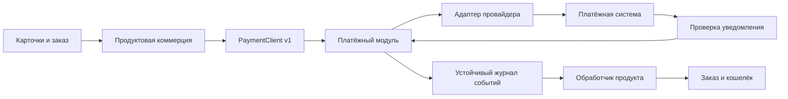

# Платёжный модуль с возможностью выделения в сервис

Статус: базовый внутренний модуль реализован 2026-09-22; sandbox ЮKassa не подключён.
План исполнения: [docs/payments-implementation-plan.md](../../../../docs/payments-implementation-plan.md).

## Назначение и границы

AI Media Client — первый потребитель. Другие продукты ожидаются в перспективе.
Сейчас модуль работает в том же Node.js-приложении, репозитории и Compose-проекте.
Отдельный deploy, БД, брокер, репозиторий и второй платёжный провайдер сейчас не нужны.

Продукт владеет карточками, тарифами, скидками, заказами, покупателем, кредитами,
подписками и правилами выдачи/отзыва покупки. Платёжный модуль получает денежное
обязательство по непрозрачному externalOrderId: сумму, валюту, описание и
необходимые сведения для провайдера. Он не рассчитывает стоимость продукта,
не знает моделей генерации и не читает кошелёк пользователя.

Платёжный модуль владеет платежами, попытками, адаптерами провайдеров,
возвратами, подтверждением статусов, сверкой и доставкой событий продукту.
Описание/данные чека передаются как валидируемые документы; их содержание
формирует продукт, а допустимость для конкретного API проверяет адаптер.
Сведения чека не дают модулю право интерпретировать продуктовые правила.

## Проверенная исходная точка

- `src/billing/wallet.js`: баланс, резерв, журнал; `purchase()` самостоятельно
  открывает транзакцию и затем вызывает необязательный `onPurchase`.
- `src/database/schema.sql`: `media_ledger` уникален по
  `(account_id, kind, reference)`. Это защита повтора внутри аккаунта,
  а не глобальная защита одного внешнего платежа от выдачи разным аккаунтам.
- `src/billing/starter-pack.js`: наличие проводки `purchase` открывает каталог;
  административный `grant` его не открывает.
- `src/services/accounts.js`: `onPurchase` уведомляет загруженный workspace.
  Надёжность выдачи не должна зависеть от этого события в памяти процесса.
- `src/database/database.js`: схема применяется на старте под advisory lock.
  Общий debug PostgreSQL используется локальным и размещённым приложением.
- `test/helpers/pg-pool.js`: PGlite сериализует соединения; это не доказательство
  корректности гонок на нескольких соединениях настоящего PostgreSQL.
- `Dockerfile`: production runtime содержит только prod-зависимости. Отдельный
  target/service `tests` содержит dev-зависимости и изолированную PGlite.

## Реализовано в текущем пакете

- `src/payments/contracts.js`, `service.js`, `providers/yookassa.js`: money/DTO,
  канонический hash, идемпотентное создание, provider attempt, terminal outbox,
  ручная сверка, проверяемый webhook и адаптер ЮKassa с `capture=true`.
- `src/commerce/`: серверный каталог, неизменяемый snapshot заказа, checkout,
  product inbox и атомарный fulfillment через `purchaseInTransaction`.
- Схема v5 разделяет `payment_*` и `media_*` без межконтекстных FK/SQL.
  Глобальная уникальность fulfillment не допускает выдачу одного payment двум
  аккаунтам; раннее событие безопасно привязывает ещё пустой заказ.
- HTTP facade, отдельный webhook URL, восстановление return URL и Vue-карточки.
  В `config/product-offers.json` заведены пять пакетов кредитов из рабочей
  коммерческой гипотезы: Старт, Базовый, Pro, Business и Agency. По умолчанию
  оба флага продаж выключены; локальный DEBUG может включать test-заглушку.
- DEBUG-адаптер `yookassa-stub` в test-среде позволяет включить карточки
  локально: checkout создаёт настоящий product order и payment attempt со
  статусом pending. Адаптер не обращается к ЮKassa, не подтверждает оплату,
  не выдаёт кредиты и не предоставляет ссылку оплаты. Live-среда его отвергает.
- Контейнерные тесты проверяют minor units, переходы, повтор checkout,
  единственную проводку, conflict payload и запрос адаптера ЮKassa.

Не реализованы: refunds, durable provider command worker после unknown,
lease/fencing outbox, admin/reconciliation UI и эксплуатационные метрики.
Многосоединительные гонки настоящего PostgreSQL и sandbox ЮKassa не проверены.

Исходники могут измениться: перед реализацией перечитать эти точки, не стирать
накопленные изменения контента/S3 и других задач.

## Архитектура и зависимости



Предлагаемая структура, создаваемая по мере этапов:

```text
src/payments/
  index.js                    # фабрика и явная сборка зависимостей
  contracts.js                # DTO v1, ошибки и валидация
  domain/                     # деньги, состояния, переходы
  application/                # create/get/reconcile/refund
  ports/                      # JSDoc-контракты repository/provider/event sink
  infrastructure/postgres/    # свои таблицы, транзакции и lease
  infrastructure/providers/   # реальные адаптеры
  delivery/                   # outbox dispatcher и reconciliation worker
  transport/                  # HTTP-обработчик provider webhook
src/commerce/
  catalog.js                  # предложения AI Media Client
  orders.js                   # снимки заказов и checkout
  fulfillment.js              # события -> выдача кредитов
  payment-client.js            # local adapter; HTTP adapter появится при выносе
  refunds.js                  # продуктовая политика и компенсации
src/server/routes/commerce.js  # пользовательский HTTP facade
test/payments-*.test.js
test/commerce-*.test.js
test/helpers/payment-provider.js
config/product-offers.json
```

- Сохранить текущий CommonJS и JavaScript; использовать JSDoc и runtime validation.
  Не менять весь проект на TypeScript и не вводить DI-фреймворк.
- Payments не импортирует `billing`, `commerce`, `accounts`, генерацию и UI.
  Его PostgreSQL-адаптер получает pool/transaction runner через фабрику;
  домен не зависит от SQL, HTTP, глобального config или `process.env`.
- Commerce обращается к payments только через PaymentClient и DTO событий.
  Он не читает `payment_*` через SQL. Payments не читает `media_*`.
- Общая БД допустима физически, но между владельцами нет FK, JOIN, триггеров,
  общих SQL-транзакций и обращения к чужим таблицам. Связи — непрозрачные ID.
- Локальный PaymentClient асинхронный, принимает/возвращает JSON-совместимые DTO;
  не передаёт SQL client, callback, Date, Error, классы или BigInt через границу.
- `server.js` собирает модуль, HTTP routes и workers; graceful shutdown закрывает
  workers перед pool. SQL миграции payments принадлежат модулю, даже если
  текущий migration runner вызывает их совместно с другими схемами.
- Архитектурный тест проверяет импорты и отсутствие чужих SQL-таблиц в модуле.
  Контрактные тесты клиентских DTO повторно используются для HTTP при выносе.

## PaymentClient v1

Доверенный контекст `ctx = { clientId, environment }` задаёт composition root,
а в будущем — серверная аутентификация. Браузер не выбирает clientId, mode,
merchant, accountId покупателя или credentials.

```js
createPayment(ctx, {
  externalOrderId, amountMinor, currency, idempotencyKey,
  description, returnUrl, paymentMethod, receipt
})
getPayment(ctx, { paymentId })
getPaymentByOrder(ctx, { externalOrderId })
requestRefund(ctx, {
  paymentId, amountMinor, idempotencyKey, reason, receipt
})
getRefund(ctx, { refundId })
```

`paymentMethod` и `receipt` необязательны только если возможности провайдера и
настройки магазина это допускают. Список методов возвращает отдельный
`getCapabilities(ctx)`; продукт показывает только поддерживаемые методы.

Результат платежа: `schemaVersion: 1`, `paymentId`, `externalOrderId`,
`amountMinor`, `currency`, `status`, `resolution`, `confirmationUrl` или null,
`expiresAt` или null, `refundedMinor`, `revision`, даты ISO UTC.
Checkout может вернуть `created/unknown` без ссылки: клиент опрашивает состояние
существующего заказа, а не создаёт новую оплату.

Ошибки: `INVALID_REQUEST`, `IDEMPOTENCY_CONFLICT`, `NOT_FOUND`,
`UNSUPPORTED_METHOD`, `PROVIDER_UNAVAILABLE`, `OPERATION_UNCERTAIN`,
`REFUND_EXCEEDS_AVAILABLE`, `FORBIDDEN`. HTTP mapping описать в schema v1;
raw Error, SQL и ответ провайдера наружу не возвращать.

Инварианты контракта:

- `amountMinor` — положительный безопасный JS integer в минимальных единицах
  валюты. Не считать, что у любой валюты два десятичных знака. Currency —
  валидируемый код из разрешённого набора; округление и перевод в формат API
  выполняет адаптер, без float-арифметики. В MVP валюта одна из конфигурации.
- Денежная сумма и `creditUnits` не смешиваются и не конвертируются платёжкой. Один отображаемый кредит равен 1000 `creditUnits` кошелька; каталог хранит минимальные единицы, а карточка делит их на масштаб кошелька.
- После создания сумма, валюта и externalOrderId неизменны. Повтор ключа с
  отличающимся значимым payload даёт conflict. Hash вычисляется по
  каноническому DTO с определёнными default/null и порядком полей.
- Ключ идемпотентности ограничен clientId + environment + operation.
  Исходный результат сохраняется дольше окна идемпотентности провайдера.
- В MVP один платёж и одна внешняя попытка на заказ. Повтор checkout возвращает
  тот же платёж. Новый заказ после подтверждённого отказа создаёт новый платёж;
  при неизвестном результате повторная покупка того же заказа блокируется.
- returnUrl строится сервером из разрешённого origin. События идут на
  зарегистрированный обработчик клиента, а не на произвольный callback URL
  из запроса. Не делать SSRF/open redirect через пользовательские URL.
- Описание, receipt и любые metadata имеют allowlist, лимиты и политику хранения.
  Не принимать PAN/CVV и не хранить платёжные реквизиты карты.

## Данные и ограничения

Все платежные uniqueness scopes включают environment. Provider account означает
конкретный магазин/merchant и ссылается на секрет по имени, не хранит его значение.

| Владелец / таблица | Минимальное содержание и ограничения |
| --- | --- |
| Product: `media_orders` | id, account_id, status, product/price version, immutable snapshot предложения, amount_minor, currency, credit_units, payment_id как непрозрачная ссылка; уникальный checkout key + account + environment |
| Product: `media_order_commands` | Устойчивая команда создания платежа/возврата: order_id, operation, payload/hash, key, state, retries, next_attempt_at, lease |
| Product: `media_payment_inbox` | Уникальные producer + environment + event_id; payload hash, order_id, processed_at; вставка processed только вместе с эффектом |
| Product: `media_order_fulfillments` | order_id UNIQUE, payment_id UNIQUE в пределах producer/environment, credit_units, ledger reference; защита повторной выдачи даже при разных event_id |
| Payments: `payment_payments` | id, client_id, environment, external_order_id, amount_minor, currency, status, resolution, revision, timestamps; UNIQUE(client_id, environment, external_order_id) |
| Payments: `payment_attempts` | payment_id UNIQUE для MVP, provider_id, provider_account_id, environment, provider_payment_id, сохранённый provider idempotency key, state, safe error; UNIQUE(provider_id, provider_account_id, environment, provider_payment_id) при ненулевом ID |
| Payments: `payment_commands` | operation, client_id, environment, idempotency_key, payload_hash, result/entity id; UNIQUE по scope команды |
| Payments: `payment_webhook_inbox` | provider/account/environment/event identity, digest, проверенный минимальный payload, processing status, retries; dedup по правилам адаптера |
| Payments: `payment_outbox` | event_id, client_id, environment, aggregate_id, revision, type, schema_version, payload, retries, next_attempt_at, lease_token, leased_until, delivered_at |
| Payments: `payment_refunds` | payment_id, amount_minor, provider_refund_id, operation key, state/resolution, timestamps; локальная уникальность команды и внешнего refund ID |

Названия — целевая схема, не уже существующие таблицы. Индексы для ожидающих
команд/outbox/reconciliation должны поддерживать выборку по next_attempt_at.
CHECK защищают сумму, валюту, статусы и переполнение. FK разрешены внутри владельца.
Секреты, полный raw provider payload и лишние персональные данные не журналировать.
Дедупликационные записи успешных денежных операций не удалять обычным GC.

## Состояния и восстановление

Платёж: `created -> pending -> succeeded | canceled | failed`.
Быстрое подтверждение допускает `created -> succeeded`. `failed` означает
доказанный окончательный отказ, а не сетевую ошибку. Локальное истечение таймера
не равно отмене платежа у провайдера. Для `created/pending` отдельно хранить
`resolution: known | unknown` и состояние сверки.

Успех не откатывается поздним pending/canceled уведомлением. Противоречивые
терминальные данные сохраняются как discrepancy, перепроверяются и требуют
разрешения; не «побеждает последнее сообщение». Refund — отдельная сущность,
не перевод платежа обратно из succeeded. Возвраты суммируются отдельно.

Заказ продукта хранит отдельно факт оплаты и выдачу: `awaiting_payment`,
`paid_pending_fulfillment`, `fulfilled`, `payment_failed`, `refund_pending`,
`refunded`, `review_required`. Оплата, замеченная через getPayment, ещё не
означает подтверждённую выдачу; запись paid допускается в транзакции с выдачей,
если оба шага выполняются сразу. UI способен показать «Оплата получена,
начисление выполняется» при задержке обработчика.

### Создание и подтверждение

1. Продукт проверяет сессию и опубликованное предложение. В своей транзакции
   сохраняет снимок заказа и устойчивую команду checkout; повтор возвращает заказ.
2. Исполнитель доставляет команду через PaymentClient. Модуль в своей транзакции
   фиксирует payment/attempt/command и ключ провайдера ДО внешнего POST.
3. Вызов провайдера выполняется вне SQL-транзакции и без удержания row lock.
   Provider key устойчив при повторах. Потерянный ответ означает unknown.
4. Ответ сохраняется; продукт привязывает paymentId к заказу. Сбой между этими
   действиями устраняется повтором исходной команды/getPaymentByOrder.
5. Проверенный webhook либо сверка подтверждает состояние, сумму, валюту,
   магазин, среду и связь с локальной попыткой. Браузерный redirect не доказательство.
6. Одной транзакцией payments обновляет состояние и добавляет outbox event.
7. Dispatcher доставляет событие продуктовому обработчику с возможными повторами.
8. Продукт проверяет совпадение order/payment/amount/currency/environment и
   атомарно записывает inbox, fulfillment, начисление и состояние заказа.
9. ACK считается полученным только после commit продукта. Потеря ACK вызывает
   повтор; он не создаёт вторую проводку. Уведомление UI идёт после commit,
   а его потеря компенсируется повторным чтением заказа/баланса.

Это две локальные транзакции с устойчивой доставкой, а не общая транзакция
payments + wallet. Такой выбор уточняет первоначальное обсуждение ради выноса.
`wallet.purchaseInTransaction(client, ...)` нужен только внутри продукта;
существующий `purchase()` сохраняется как wrapper для совместимости.
Не допустить двойного `onPurchase` или ошибки уведомления как «отката» оплаты.

### Уведомления и события

Event envelope: `schemaVersion`, `eventId`, `type`, `occurredAt`, `clientId`,
`environment`, `paymentId`, `externalOrderId`, `revision`, денежные поля;
для refund — `refundId` и его сумма. Основные типы: `payment.succeeded`,
`payment.canceled`, `payment.failed`, `refund.succeeded`, `refund.failed`.

Проверка webhook зависит от реального API: подпись проверять, если провайдер
её предоставляет; иначе применить его документированный способ проверки и
серверное чтение объекта. Не выдумывать универсальную HMAC-подпись провайдеров.
Подтверждать приём только после устойчивого сохранения; недоступность БД должна
приводить к retryable ответу согласно контракту провайдера. Ограничить размер,
скорость запросов; проверять raw body, если подпись требует исходные байты.

Не полагаться на порядок доставки. Повтор eventId с другим hash — ошибка.
Разные eventId об одном успехе не дают повторной выдачи благодаря fulfillment.
Refund, пришедший до события выдачи, удерживается до восстановления предпосылок:
нельзя просто отбросить старшее/младшее revision или начислить уже возвращённую
покупку. Неизвестная версия события сохраняется для разбора без денежного эффекта.
Неизвестный order/payment — review_required, без начисления по metadata accountId.

### Workers и неизвестные исходы

Dispatcher, product command worker и reconciler работают с leases в PostgreSQL.
Захват — короткая транзакция, `FOR UPDATE SKIP LOCKED`; обработка вне неё.
Lease token используется как fencing при записи результата. Истёкший lease
позволяет восстановление после crash; внешний повтор защищает provider key.
Параллелизм, интервалы, batch size, backoff, jitter и лимиты API — конфигурация.

После таймаута create/refund сначала выяснять судьбу прежней операции по ID,
idempotency key или документированному provider lookup. Повтор POST допустим
только с тем же ключом в гарантированном провайдером окне. За пределами окна
или без возможности доказать исход — manual review; новая попытка запрещена.
Не выполнять автоматический fallback к другому провайдеру после неоднозначного POST.
Лимит технических retry не превращает платёж в failed и не удаляет событие.

## Возвраты

Payments проверяет принадлежность платежа клиенту и денежные ограничения.
Под блокировкой платежа резервирует сумму возврата: подтверждённые + pending +
unknown возвраты не превышают полученную сумму. Refund POST выполняется после
commit с сохранённым ключом; резерв освобождается только при доказанном отказе.
Полные/частичные возвраты поддерживаются только при capability адаптера.
Refund имеет состояния `created -> pending -> succeeded | failed` и отдельный
`resolution: known | unknown`; прямой `created -> succeeded` допустим. Timeout
не даёт failed. Сумма возврата неизменна, успех не откатывается запоздалым pending.

Продукт решает, что делать с уже выданными или потраченными кредитами,
бонусами и открытым стартовым каталогом. До выбора этой политики UI/API запуска
реальных возвратов выключены. При её реализации потребуется продуктовый резерв
кредитов на время refund и отдельная компенсирующая проводка; использовать
генерационные media_reservations для этого нельзя. Старые проводки не удалять.
Внешний возврат/оспаривание через кабинет провайдера тоже сверяется: событие
не должно автоматически загонять balance ниже held/нуля. Необработанные случаи
дают review_required и видимое действие оператору. Продажи live не включать,
пока выбран и проверен хотя бы один рабочий путь возврата/разбора таких случаев.

## Конфигурация, безопасность и диагностика

- По умолчанию payments и продажа предложений выключены. Среды test/live и
  provider credentials разделены. Отдельный local fake доступен только тестам
  с изолированной БД, никогда общему debug кошельку или публичному HTTP.
- Sandbox реального провайдера тоже работает с изолированными продуктовыми
  аккаунтами/кошельками в тестовой БД. Текущий wallet не разделён по environment:
  одного поля mode в платеже недостаточно для безопасного тестового начисления.
  Не зачислять sandbox-покупки в общую debug/live БД пользователей.
- Предлагаемые config границы: `payments.enabled`, `environment`, `clientId`,
  `providerAccounts`, `allowedCurrencies`, `allowedReturnOrigins`, worker settings;
  `commerce.offersFile`, `commerce.salesEnabled`. Загрузить через существующий
  `src/server/config.js`, секреты — только ссылки/env. Образец без значений.
- Покупатель в public routes определяется серверной сессией. Чтение чужого заказа,
  подмена цены/кредитов, произвольный merchant/provider и запуск refund запрещены.
- Admin reconciliation/refund/retry требуют текущего RBAC и аудита actor/reason;
  ручное «сделать оплачено» без доказательства провайдера не добавлять.
- Логи содержат correlation/order/payment/event IDs и безопасный error code,
  без секретов, confirmationUrl-токенов и полных receipt. Метрики: unknown age,
  outbox lag/retries, paid-but-unfulfilled, duplicate suppression, refund mismatch.
- Платёжный провайдер может быть недоступен при работоспособной студии.
  Диагностику payments держать отдельной; отключённые продажи не ломают генерации.
- При общей debug БД несколько экземпляров конкурируют через leases, а не
  память процесса. Webhook endpoint — стабильный HTTPS размещённого сервера;
  привязка merchant/environment согласована с обоими экземплярами.

## Карточки и UX первого продукта

MVP продаёт разовые пакеты кредитов. Подписки/автоплатежи, промокоды, сложные
скидки, несколько валют и автоматическая маршрутизация между провайдерами — позже.
Это граница первого этапа, а не ограничение платежного денежного контракта.

Предложение: productId, version, название/локализация, description, creditUnits,
amountMinor, currency, active. Продукт формирует неизменяемый снимок заказа.
UI использует серверный каталог и его форматирование денег. Цены/количество
кредитов должны быть выбраны владельцем; тестовые примеры не публиковать.
Повтор клика с тем же checkout key возвращает прежний заказ; изменение цены
до создания заказа требует показать актуальную цену, а не молча списать другую.

Состояния UI: загрузка, нет доступных предложений, создание оплаты, переход к
провайдеру, ожидание подтверждения, начисление, готово, отказ, статус уточняется.
После refresh пользователь видит тот же заказ; успех — только после fulfillment.
Web/API используют общую реализацию; платёжный UI Telegram/desktop расширяется
отдельно при наличии подтверждённого аккаунтного потока.

## Выделение в сервис — отдельный будущий этап

1. Проверить отсутствие межмодульных SQL/FK/import зависимостей и запустить
   контрактные тесты. Доказать работу на раздельных тестовых PostgreSQL-базах.
2. Добавить HTTP PaymentClient и standalone composition root payments.
   Доменные/application/provider модули переносятся без изменения поведения.
3. Сервисная аутентификация назначает clientId, права merchant/environment,
   rate limits; TLS, rotation credentials, allowlisted endpoint конфигурация.
   События передаются по аутентифицированному каналу с timestamp/replay protection;
   inbox остаётся окончательной защитой повторного эффекта.
4. Подготовить backup/restore rehearsal и согласованный migration/cutover plan.
   Переносить payments, attempts, refunds, commands, webhook inbox, outbox,
   dedup keys, revisions и merchant identity с сохранением ID; media_* остаются.
5. На cutover остановить новые checkout/refund команды, корректно остановить
   writers/workers, обеспечить durable приём/retry webhook, скопировать данные
   и сверить количества/суммы/незавершённые операции. Не допускать двух writers.
6. Переключить PaymentClient и webhook ingress, включить workers нового сервиса,
   воспроизвести недоставленные события и проверить paid-but-unfulfilled = 0
   либо объяснимый список. Не создавать внешние платежи повторно.
7. Удалить у приложения права на payment_* и секреты провайдеров. Проверить,
   что платёжный сервис не имеет доступа к кошелькам/генерациям/медиа.
8. Rollback до новых записей возможен переключением владельца. После новых записей
   нужен обратный перенос состояния или forward fix; старую копию просто
   включать нельзя. Старые данные удаляются только отдельным согласованным шагом.

Брокер сообщений не обязателен: outbox + аутентифицированный HTTP достаточно
для первого выноса. Второй продукт получает собственный clientId/handler,
доступ только к своим платежам и самостоятельно выдаёт свои покупки.

## Источники и открытые решения

- [Границы владения данными Microsoft](https://learn.microsoft.com/en-us/dotnet/architecture/microservices/architect-microservice-container-applications/data-sovereignty-per-microservice):
  раздельное владение и отсутствие общей ACID-транзакции между сервисами.
- [Документация уведомлений ЮKassa](https://yookassa.ru/developers/using-api/webhooks):
  пример официального контракта. По ссылке владельца 2026-09-22 дополнительно
  изучен [тестовый магазин](https://yookassa.ru/docs/support/merchant/payments/implement/test-store).
  ЮKassa подходит первым sandbox-кандидатом; подтверждённые возможности,
  ограничения и требования записаны в P5 плана реализации. Магазин/ключи ещё
  не настроены, код не реализован, выбор для live не сделан.
- Требуют входных данных: первый провайдер/merchant, реальные предложения,
  валюта, данные чека и применимые настройки, правила возврата потраченных
  кредитов/бонусов и влияние возврата на стартовый доступ.
- Эти неизвестные не мешают контрактам, ядру, локальным тестам и UI с закрытой
  продажей. Они блокируют соответствующие интеграции и включение реальных денег.
