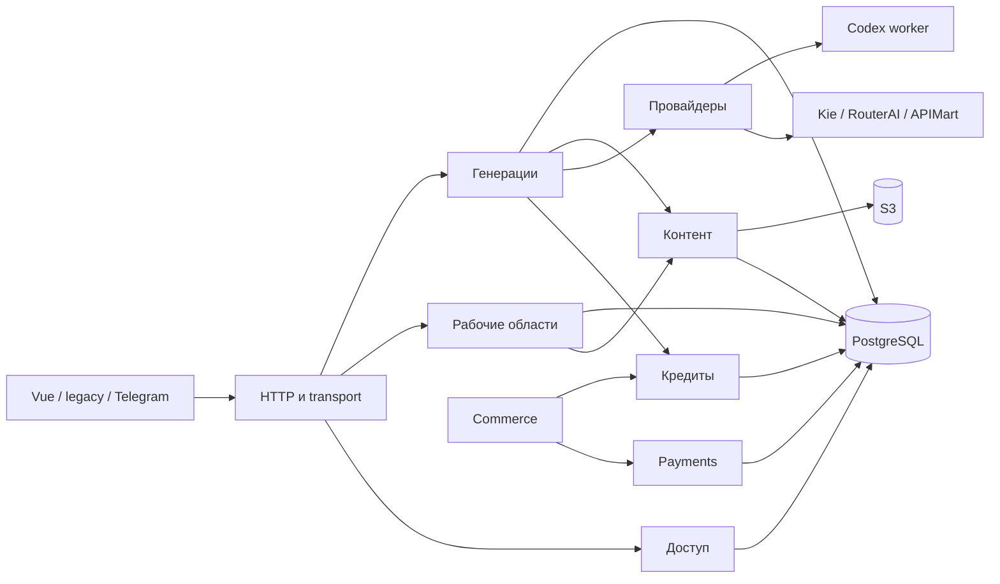

# Карта логических модулей веб-сервиса

Статус: смешанный. Проверено по исходникам 2026-09-28. Это карта текущих границ
и известных обходов; будущие переходы описаны в
[плане модульности](../../../docs/modularity-improvement-plan.md).

## Система и сквозной поток

Vue и legacy UI, Telegram и HTTP API работают с одним продуктовым контуром.
Сервис `media` исполняет API и прикладную логику; `codex` исполняет изолированный
worker. Web-реплики читают общую PostgreSQL и пересылают записи одному executor.
Схема процессов и внешних систем: [технологический стек](technology-stack.md),
[владение репликами](features/replica-ownership.md), `compose.yaml`.

Реализованный путь Kie: UI → HTTP → проверка аккаунта/чата → сервис генераций →
котировка и резерв кошелька → очередь → Kie → запись истории и результата →
ContentService/S3 → UI. Неизвестный исход сохраняет резерв до выяснения.
Доказательства: `src/server/http.js`, `src/server/routes/workspace.js`,
`src/server/routes/generation.js`, `src/server/routes/admin.js`,
`src/server/routes/content.js`,
`src/server/generation-services.js`, `src/services/accounts.js`,
`src/services/media-service.js`, `src/billing/wallet.js`,
`src/services/content-service.js`, `test/web-service.test.js`,
`test/content-service.test.js`. Полный живой путь через Kie в этой проверке не запускался.

Стрелки показывают логические зависимости. Payments является модулем внутри
`media` с отдельным денежным контрактом. Таблицы физически находятся в общей БД.

## Владение состоянием

| Владелец | Таблицы, namespace и файлы | Текущие потребители и граница |
| --- | --- | --- |
| Доступ | `media_accounts`, `media_identities`, `media_sessions`, OAuth и email flows, `media_role_audit`; Telegram links/flows | `src/auth/`, `src/services/telegram-link.js`; HTTP использует `auth.user`, `accounts.scope`. Создание аккаунта также создаёт кошелёк и основной чат одной транзакцией. |
| Рабочие области | `media_projects`, `media_chats`, `media_deleted_chat_records`, `media_file_deletions`; namespace `drafts`, `preferences`, `templates`, `presets` в `media_records` | `src/services/workspaces.js`, `workspace-deletions.js`, `AccountRecords`; API обращается через `accounts.workspaces`. |
| Генерации | namespace `history`, `codex`, `routerai`, `apimart` в `media_records`; `media_kie_submissions`; состояние очереди в памяти | `src/services/media-service.js`, provider billing/jobs, `generation-history.js`; sync получает счётчик без чата через `countUnassignedGenerations`. |
| Кредиты | `media_wallets`, `media_reservations`, `media_ledger`, `media_reconciliations` | `src/billing/wallet.js` и профильные сервисы генераций; резерв/запись задания и settlement/журнал требуют общей транзакции. Административный ledger читается через `wallet.auditLedger`; составная статистика starter pack и диагностика читают ledger для специальных read models. |
| Контент | `content_assets`, `content_links`, `content_jobs`, объект S3 `accounts/<account-id>/content/<asset-uuid>` | `src/services/content-service.js`; другие модули используют `accounts.content` для сохранения и чтения. |
| Commerce | `media_orders`, `media_payment_inbox`, `media_order_fulfillments` | `src/commerce/service.js`; обработка события платежа и выдача кредитов атомарны в продуктовой БД. |
| Payments | `payment_payments`, `payment_commands`, `payment_attempts`, `payment_webhook_inbox`, `payment_outbox` | `src/payments/service.js`; Commerce использует PaymentClient и версионированное событие, не читает денежные таблицы. |
| Платформа | `media_schema_versions`, `media_system_errors`, файлы диагностических журналов | `src/database/`, `src/system-errors.js`, `src/generation-log.js`; конфигурация — `src/server/config.js`. |

Источник схемы: `src/database/schema.sql`, `src/database/migrations/`.
Namespace разделяют одну физическую таблицу. Его владелец задаёт смысл данных;
`AccountRecords` предоставляет общий механизм сохранения. Прямые межмодульные
SQL-чтения выше остаются переходными точками M3, а не утверждёнными контрактами.

## Паспорта основных модулей

### Доступ и аккаунты

Роль: проверять личность, роль и доступ к выбранному аккаунту; создать состояние
нового аккаунта. Входы: HTTP/cookie, OAuth, Telegram. Выходы: пользователь,
сессия и разрешённая область. Ошибка входа не открывает защищённые данные.
Зависит от PostgreSQL и настроенных способов входа; необязательный способ
отключается при неверной конфигурации. Источник правил и тестов:
[аккаунты](features/accounts-credits.md), `src/auth/service.js`,
`src/auth/roles.js`, `test/accounts.test.js`, `test/roles.test.js`.

### Рабочие области

Роль: проекты, чаты, выбор активной области и привязка черновика/задания.
Входы: account ID и команды API. Выходы: данные только выбранного аккаунта;
архивирование/удаление обновляет связанные состояния по контракту.
Зависит от проверки доступа, БД и ContentService при удалении.
Источник правил и тестов: [чаты и проекты](features/web-workspaces-chats-projects.md),
`src/services/workspaces.js`, `test/workspaces.test.js`.

### Генерации и провайдеры

Генерации владеют запуском, очередью, историей и повтором; адаптеры переводят
запросы и ответы поставщиков, не владеют кошельком или файлами пользователя.
Входы: разрешённый аккаунт, модель, параметры и requestId. Выходы: котировка,
задача, статус и результат; неизвестная отправка не повторяется автоматически.
Зависимости: кошелёк, контент, провайдеры, конфигурация и worker.
Источник правил: [очередь](features/generation-queue.md),
[общий контракт](integration-contracts/provider-core.md),
[граница медиа](features/media-provider-boundary.md). Тесты:
`test/web-service.test.js`, `test/codex.test.js`, `test/routerai.test.js`,
`test/apimart.test.js`, `test/media-contract.test.js`.
Общий контракт полностью принят APIMart, а Codex использует его для котировки,
отправки и чтения задания. Kie и RouterAI ещё сохраняют отдельные маршруты.
Обработчик Codex/RouterAI/APIMart вынесен из
`http.js`, но только часть маршрутов использует общий контракт. Media-фасад описывает
виды медиа, а не кошелёк.

### Кредиты и контент

Кредиты предоставляют котировку, резерв, settlement и историю списаний.
Побочные эффекты — строки кошелька, резерва и ledger; отрицательный доступный
остаток и двойное списание запрещены. [Правила кредитов](features/accounts-credits.md),
[учёт затрат](business-rules/cost-accounting.md), `test/credit-conversion.test.js`.

Контент предоставляет регистрацию, сохранение, связи и выдачу файла владельцу.
Недоступный файл не запускает задачу, отказ сохранения остаётся видимым и
восстанавливаемым. Зависит от PostgreSQL и приватного S3 или настроенного
локального fallback. [Контракт контента](features/content-module-plan.md),
[хранение](features/media-storage.md), `test/content-service.test.js`.

### Commerce и Payments

Commerce владеет предложением, заказом и выдачей покупки. Payments владеет
денежной операцией и состоянием провайдера, передаёт Commerce событие с версией.
Повтор события не начисляет кредиты повторно; неизвестный платёж не превращается
в успешный. Зависимости: Commerce → PaymentClient и wallet;
Payments → собственный провайдер и БД. Источник истины:
[платёжный модуль](features/payments-module.md), `src/commerce/service.js`,
`src/payments/service.js`, `test/payments.test.js`, `test/payments-postgres.test.js`.

## Общие правила и открытые границы

На клиенте `web/src/stores/studio.ts` пока владеет выбором чата, черновиком,
историей и отправкой. Состояние котировки, таймер и защита от устаревшего ответа
выделены в `web/src/composables/useLatestQuote.ts`; `Composer.vue` подготавливает
провайдерский запрос и показывает результат. Остальные границы M5 ещё открыты.

- Доступ и роли: `src/auth/roles.js`, [аккаунты](features/accounts-credits.md).
- Конфигурация и секреты: `src/server/config.js`, `.env.example`, `compose.yaml`.
- Ошибки и диагностика: `src/system-errors.js`,
  [журнал](../../../docs/generation-logging.md).
- Версии БД: `src/database/schema.sql`, `src/database/migrations/`,
  `scripts/migrate-schema.cjs`.
- Health и развёртывание: `src/server/http.js`, `compose.yaml`,
  [runbook](../../AGENT_RUNBOOK.md).

Переходные обходы: HTTP использует `accounts.pool` для health;
`src/services/accounts.js` читает ledger и записи генераций для составных представлений starter pack и сверки;
`src/database/records.js` совместно пишет историю и резерв. При M3 эти
взаимодействия нужно либо оформить как операции владельцев, либо оставить
явный составной транзакционный контракт с тестом инварианта.
