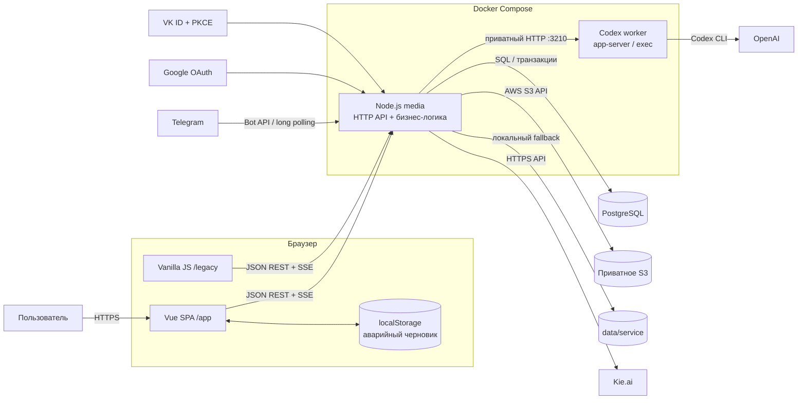
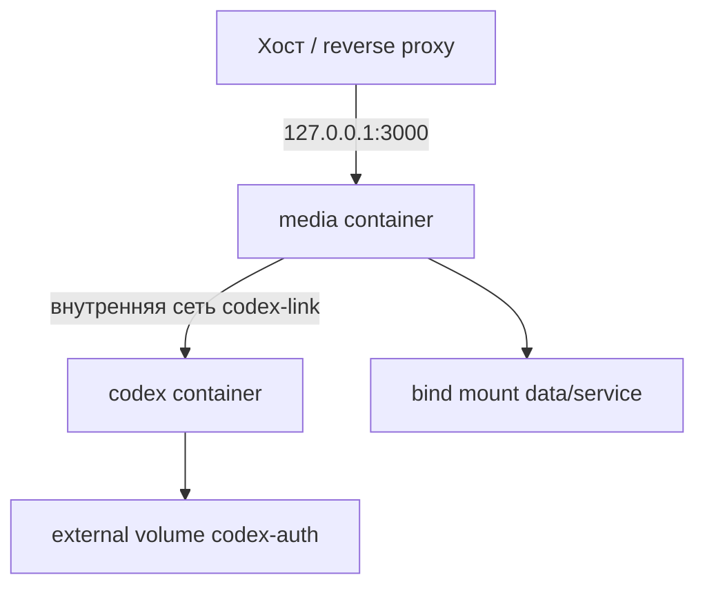

# Технологический стек AI Media Client

> Актуально на 22 сентября 2026 года.
>
> Источники истины: `package.json`, `pnpm-lock.yaml`, `compose.yaml`, Dockerfile,
> конфигурация Vite, SQL-схема и действующие точки входа приложения.

## Коротко

**Vue 3 + TypeScript + Vite → Node.js HTTP API → PostgreSQL и S3 → Kie.ai и Codex CLI → Docker Compose.**

AI Media Client — единый web-сервис для генерации изображений, видео, аудио и
текста. Пользовательский интерфейс, API, аккаунты, биллинг и история работают в
сервисе `media`; генерации Codex вынесены в изолированный приватный worker.

## Архитектура

## Карта технологий

| Слой | Технологии | Назначение |
| --- | --- | --- |
| Web UI | Vue 3.5, TypeScript 5.9, Pinia 3, Vue Router 4.5 | SPA-студия, проекты, чаты, генерации, история |
| Legacy UI | JavaScript, HTML, CSS | Главная, административная панель и прежняя студия |
| Сборка UI | Vite 8.3, `@vitejs/plugin-vue` 6.0.9, vue-tsc 3.3.11 | Сборка `/app` в `public/vue`, проверка типов |
| Backend | Node.js 24 в Docker, CommonJS, встроенный `node:http` | Web-сервис, JSON API, статика, SSE и оркестрация |
| Валидация | AJV 8.20 | Проверка JSON-контрактов и импортируемых данных |
| База данных | PostgreSQL, `pg` 8.22 | Аккаунты, сессии, проекты, чаты, история и биллинг |
| Тестовая БД | PGlite 0.5.8 | Изолированные PostgreSQL-совместимые тесты |
| Object storage | S3-compatible API, AWS SDK for JavaScript 3.1136 | Приватные пользовательские медиа и PNG Codex |
| Локальное хранение | JSON, SHA-256-объекты, `data/service` | Legacy-совместимость, журналы и файловый fallback |
| Очередь | Собственный in-process `TaskQueue` | Параллелизм, пауза, продолжение и отмена задач |
| Провайдер медиа | Kie.ai HTTP API | Генерация изображений, видео и аудио |
| Провайдер AI | OpenAI Codex CLI 0.155.0 | Генерация текста и PNG через app-server или exec |
| Telegram | Telegram Bot API, long polling | Интерфейс бота в локальном режиме владельца |
| Контейнеризация | Docker, Docker Compose | Сервисы `media` и `codex`, сети, тома и healthchecks |
| Пакеты | pnpm, lockfile; pnpm 11.19 в production-образе | Воспроизводимая установка зависимостей |
| Тесты | `node:test`, `node:assert`, PGlite, headless UI smoke | Unit-, integration-, database- и UI-проверки |

## Frontend

### Основная студия

- **Vue 3.5** с Composition API.
- **TypeScript 5.9** в строгом режиме.
- **Pinia 3** хранит состояние студии, провайдера, моделей, истории и черновиков.
- **Vue Router 4.5** управляет маршрутами SPA.
- **Vite 8.3** собирает приложение с base path `/app/` в `public/vue`.
- `localStorage` используется только как временная страховка несохранённого
  браузерного черновика; постоянные пользовательские данные принадлежат серверу.

### Legacy-слой

Главная страница, административные экраны и прежняя студия используют обычные
HTML, CSS и браузерный JavaScript. Отдельного CSS-фреймворка или UI-kit нет.

## Backend и API

- Минимальная версия runtime — **Node.js 22.9**; production-образ использует
  **Node.js 24 на Debian Bookworm Slim**.
- Backend написан на **JavaScript CommonJS**.
- Сервер построен на встроенном `node:http`, без Express, Fastify и NestJS.
- Используются встроенные `fetch`, Web Streams, `AbortSignal`, crypto и fs API.
- Основной интерфейс — JSON REST API.
- События основной очереди доставляются через **Server-Sent Events**.
- Состояние заданий Codex обновляется клиентским polling.
- Тот же процесс раздаёт статику, SPA, legacy UI и защищённые медиа.

## Данные и хранение

### PostgreSQL

Приложение использует SQL напрямую через `pg`, без ORM. Схема и версионированные
миграции применяются транзакционно при старте. В базе находятся:

- аккаунты и привязанные OAuth-идентичности;
- серверные сессии и краткоживущие OAuth flow;
- проекты, чаты и account-scoped записи;
- история генераций и ссылки на результаты;
- кошельки, резервы, списания, возвраты и immutable ledger;
- административные приглашения, роли и аудит.

### Медиа

Основной backend медиа — приватное **S3-compatible хранилище** через
`@aws-sdk/client-s3`. Для локальной разработки и совместимости доступен файловый
fallback в `data/service`. Старый файловый слой использует контентные SHA-256
объекты. Медиа разделяются по аккаунтам; Codex PNG проходят проверку типа и
размера до сохранения.

### Чего в слое данных нет

В проекте нет ORM, Redis, RabbitMQ, Kafka и векторной базы данных.

## Авторизация и безопасность

- Google OAuth 2.0 Authorization Code.
- VK ID Authorization Code с PKCE S256.
- Opaque-сессии хранятся в PostgreSQL.
- Cookie имеют `HttpOnly`, `SameSite=Lax` и `Secure` при HTTPS.
- Администраторы определяются явным allowlist неизменяемых provider identity,
  а не совпадением email или порядком регистрации.
- Секреты поступают только из server environment / `.env` и не включаются в
  клиентскую сборку.
- Публичный auth-режим требует PostgreSQL и канонический HTTPS origin.
- Режим владельца без OAuth разрешён только явно и на loopback.

## Генеративные провайдеры

### Kie.ai

- Нативный HTTP-клиент на `fetch`.
- Генерация изображений, видео и поддерживаемых каталогом аудиорезультатов.
- Динамические формы параметров моделей, отправка задач, polling и загрузка
  результатов.
- `KIE_API_KEY` принадлежит серверу; формы ввода ключа в клиенте нет.

### OpenAI Codex

- **Codex CLI 0.155.0**.
- Генерация текста и PNG.
- Основной транспорт — **app-server**; `codex exec` сохранён как ручной fallback.
- По умолчанию работает пул из двух долгоживущих app-server процессов.
- Worker предоставляет приватный loopback HTTP API на порту `3210`.
- Авторизация сохраняется в отдельном Docker volume после `codex login --device-auth`.
- Пользователь выбирает модель, reasoning effort, Standard/Fast и допустимое
  соотношение сторон.
- Каталог возможностей синхронизируется в `config/codex-models.json`.
- Sidecar собирается поверх локального образа `llm-providers:local`.

## Telegram

Telegram-интерфейс использует Bot API через нативный `fetch` и long polling —
отдельной Telegram-библиотеки нет. Поддерживаются публичный доступ к личным чатам
или private allowlist. В режиме продуктовых аккаунтов бот пока отключён до
реализации привязки Telegram-пользователя к аккаунту.

## Очередь и биллинг

- Собственная очередь `TaskQueue`, без внешнего message broker.
- Пауза, продолжение, очистка и управляемый параллелизм.
- Account-scoped история и серверное восстановление состояния.
- Цены версионируются в JSON-конфигурации.
- Финансовый цикл: quote → reservation → execution → settle/refund → ledger.
- Денежные значения хранятся как целые базовые единицы, без float-арифметики.

## Docker и эксплуатация

### `media`

- Образ `node:24-bookworm-slim`.
- Запуск от непривилегированного пользователя `node`.
- Web/API healthcheck: `/api/health`.
- Данные подключаются из `data/service`.

### `codex`

- Отдельный приватный sidecar.
- Read-only root filesystem.
- `cap_drop: ALL` и `no-new-privileges`.
- Ограниченный временный `/tmp`.
- Собственный healthcheck на `127.0.0.1:3210/health`.
- Постоянный внешний том хранит только авторизацию Codex.

## Проверки и качество

| Проверка | Команда |
| --- | --- |
| Синтаксис backend и legacy JS | `pnpm check` |
| Unit и integration tests | `pnpm test` |
| Сборка Vue | `pnpm build:web` |
| Типы Vue/TypeScript | `pnpm check:web:vue` |
| Полная Compose-пересборка | `docker compose up -d --build` |
| Состояние контейнеров | `docker compose ps` |
| Health web/API | `Invoke-RestMethod -Uri http://127.0.0.1:3000/api/health` |
| Проверка diff | `git diff --check` |

Тестовая база — `node:test` и `node:assert/strict`. PGlite изолирует SQL-тесты;
headless UI smoke использует Electron `BrowserWindow` только как тестовый
браузерный harness. ESLint, Prettier, Playwright и отдельный e2e-фреймворк сейчас
не настроены.

## Логирование и наблюдаемость

- Структурированный журнал цепочки генерации в JSONL.
- Request/correlation context через `AsyncLocalStorage`.
- Build info и health API.
- Провайдерские стадии, ошибки, расходы и результаты связываются одним request ID.
- Prometheus, Grafana, OpenTelemetry и Sentry пока не подключены.

## Статус desktop / Electron

Electron не входит в активный production runtime текущего дерева:

- исходного каталога `desktop/` и desktop-манифеста в текущем checkout нет;
- сохранён архив `desktop.7z` исторического Windows-клиента;
- Electron остаётся только средством запуска скрытого UI smoke в доступном
  окружении разработчика;
- старые ссылки на desktop-сборку в README и runbook следует считать
  документационным долгом до отдельной очистки согласованного scope.

## Основные источники

- `package.json`, `pnpm-lock.yaml` — версии runtime-зависимостей.
- `web/vite.config.mts`, `web/tsconfig.json`, `web/src/` — Vue-приложение.
- `server.js`, `src/server/`, `src/services/` — backend и оркестрация.
- `src/database/schema.sql` — продуктовая SQL-схема.
- `src/object-storage.js` — S3 и файловый storage adapter.
- `config/codex-models.json`, `src/services/codex-*` — Codex worker.
- `compose.yaml`, `Dockerfile`, `Dockerfile.codex` — production topology.
- `.env.example` — конфигурационные границы без секретных значений.

## Открытые ограничения

- Покупка кредитов и автоматическая балансировка провайдеров не подключены.
- Telegram ещё не связан с продуктовыми аккаунтами.
- В проекте нет централизованной metrics/tracing-платформы.
- Host-версия pnpm не закреплена в `package.json`; production-образ фиксирует
  pnpm 11.19.0.
